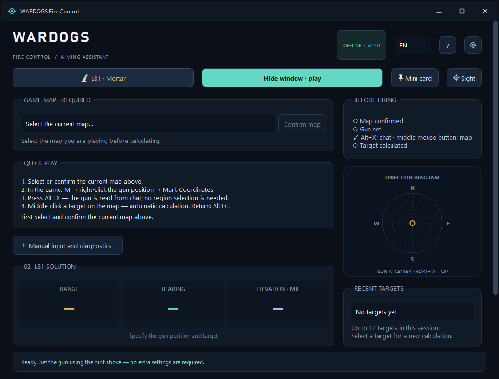
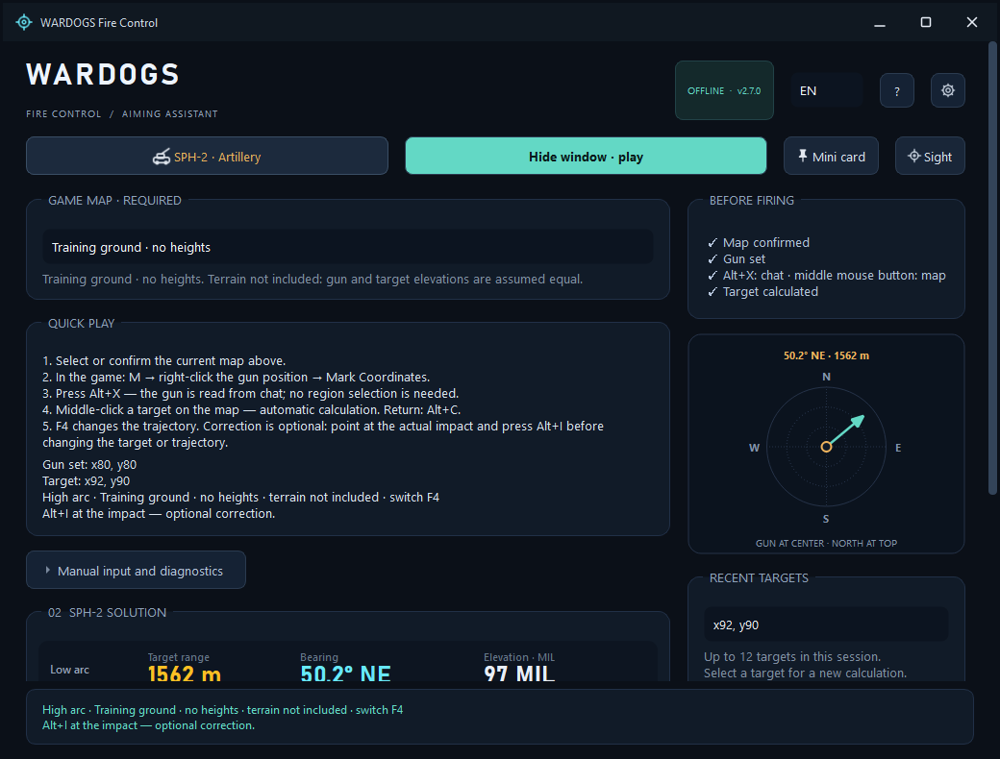
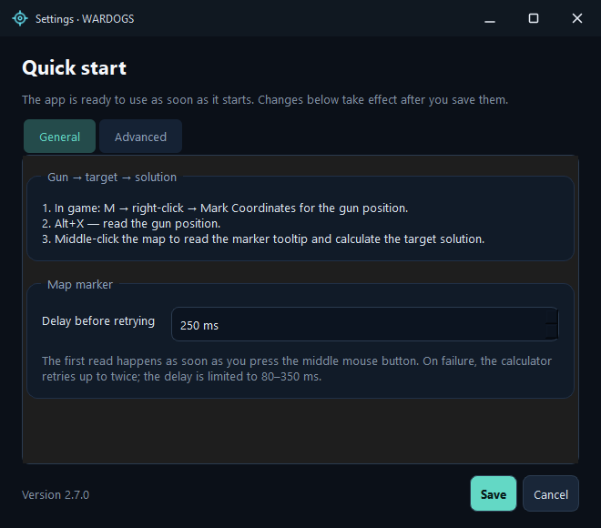
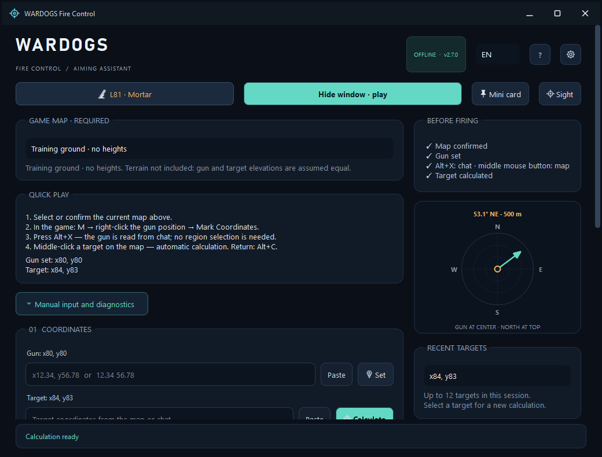
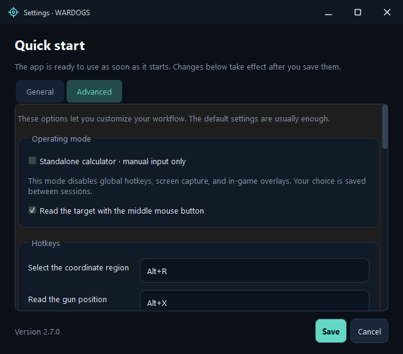
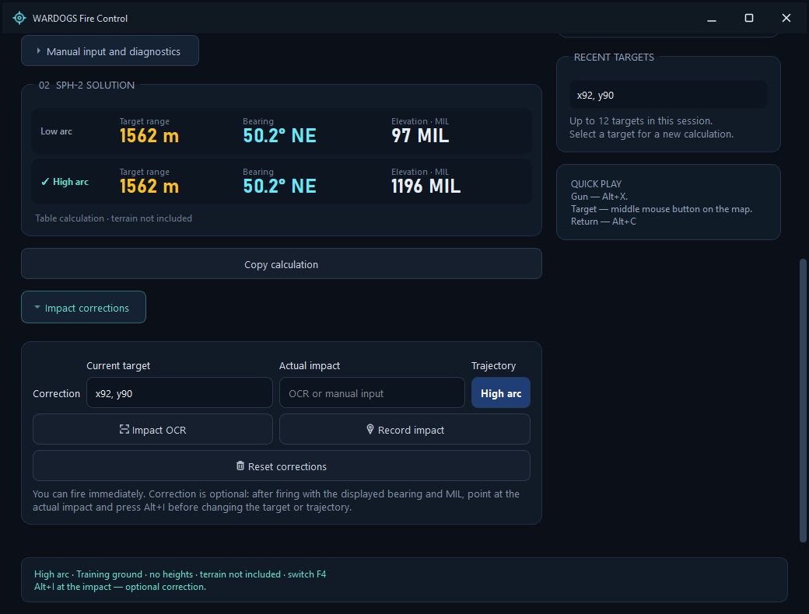
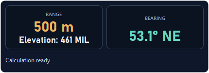

# WARDOGS Fire Control

**A native aiming assistant for the L81 mortar and SPH-2 artillery in WARDOGS.** Coordinates → range, bearing and MIL → aim in the game.

[Русский](README.md) · **English** · [Download](https://github.com/sany86russ/Wardogs-Fire-Control/releases/latest) · [Quick start](source/docs/QUICKSTART-EN.md) · [Report an issue](https://github.com/sany86russ/Wardogs-Fire-Control/issues)

The app transfers map points into an aiming calculation: **Alt+X** reads the gun position from the active chat draft; the **middle mouse button** reads a target beside the map cursor. Results are available in the main window, an always-on-top mini card and an auxiliary sight overlay. Fully manual operation is also available.

**Version 2.8.0:** GitHub release updates inside the app. Startup checks, a new-version banner, SHA-256 verified downloads and a complete portable package update with restart. The interface and help are available in Russian and English; switching languages does not require a restart.

> This is an unofficial community utility for the **WARDOGS game**. It is not affiliated with BULKHEAD and is not intended for real weapons. Developer approval for OCR, global hotkeys and overlays has not been confirmed; freedom from sanctions is not guaranteed. Read the [interaction limits and rules](source/docs/ANTICHEAT-EN.md) before using game features.

## Contents

- [What the app is for](#what-the-app-is-for)
- [Features](#features)
- [Download and launch](#download-and-launch)
- [Your first calculation](#your-first-calculation)
- [L81 and SPH-2](#l81-and-sph-2)
- [Controls](#controls)
- [Language and settings](#language-and-settings)
- [How the calculations work](#how-the-calculations-work)
- [Maps and elevations](#maps-and-elevations)
- [OCR and coordinate review](#ocr-and-coordinate-review)
- [Local data and privacy](#local-data-and-privacy)
- [Screenshots](#screenshots)
- [Documentation and building](#documentation-and-building)
- [Limitations and feedback](#limitations-and-feedback)
- [Origins and licenses](#origins-and-licenses)
- [Support the author](#support)
- [Trouble connecting to WARDOGS](#trouble-connecting-to-wardogs)

## What the app is for

- **Mortar calculations:** obtain range, bearing and tabulated MIL for the L81 from the gun and target positions.
- **SPH-2 artillery:** compare the available low and high arcs, select an aiming solution and optionally refine it using an observed impact.
- **Multiple targets from one position:** acquire each new target with a middle click, return to recent points and copy a calculation for coordination.
- **Training and manual use:** enter coordinates without screen capture, check distances and explore the mathematics in the open source.
- **Two interface languages:** switch between RU and EN while preserving calculation state.

The app calculates aiming commands. Setting the in-game bearing and MIL, deciding when to fire and checking the result remain the player's actions.

## Features

| Feature | What it provides |
|---|---|
| **L81** | Interpolation over 71 original samples; 132–684 m range and 850–150 MIL |
| **SPH-2** | Two game tables, a direct target solution and arc selection |
| **Quick input** | Gun position from the active chat draft; target from X/Y labels beside the cursor |
| **Local OCR** | CPU recognition with a bundled model; no cloud service needed |
| **Uncertain-reading review** | Inspect candidate pairs, edit coordinates, explicitly apply or reject |
| **Manual mode** | Coordinate entry and paste; game features can be disabled |
| **Mini card and sight** | Results above other windows, with opacity, size and locking controls |
| **SPH-2 impact corrections** | Optional refinement near the current target on the selected arc |
| **SPH-2 terrain** | Verified local import of compatible elevations; an explicit no-height mode |
| **History and clipboard** | Up to 12 targets per session and copying the calculation |
| **RU / EN** | Instant translation of windows, buttons, errors, hints and copied results |
| **Portable package** | Run from an extracted folder; no SDK or Python required for use |

## Download and launch

**Requirements:** Windows 10/11 x64. Normal use does not require app installation, administrator privileges, the Qt SDK, Visual Studio or Python.

1. Open the [latest release](https://github.com/sany86russ/Wardogs-Fire-Control/releases/latest).
2. Download **WardogsFireControl-v2.8.0-win-x64.zip** from **Assets**.
3. **Extract the entire ZIP** into its own folder.
4. Run **Start.cmd**, **Запустить.cmd** or **WarDogsDistanceCalculator.exe** inside the extracted package.

Keep the EXE together with its DLLs and the <code>platforms</code> and <code>models</code> folders. GitHub's **Source code (zip/tar.gz)** archives contain source code; use the ZIP in Assets to run the ready-made program.

Use **borderless windowed mode** for the mini card and sight. Overlays in exclusive fullscreen need separate verification and may be unavailable.

### Verify the download

Release archives are accompanied by a SHA-256 checksum file. Compare its entry with:

~~~powershell
Get-FileHash .\WardogsFireControl-v2.8.0-win-x64.zip -Algorithm SHA256
~~~

The checksum checks download integrity. With GitHub CLI installed, you can also verify build provenance through GitHub attestations:

~~~powershell
gh attestation verify .\WardogsFireControl-v2.8.0-win-x64.zip --repo sany86russ/Wardogs-Fire-Control
~~~

### Updating inside the app

Starting with **2.8.0**, the app checks this repository's latest stable release at startup. The check runs in the background: the calculator keeps working without an internet connection. You can disable startup checks in Settings; the manual **Check for updates** button remains available.

The new-version banner offers **Update**, **What's new** and **Later**. Installation starts only after you click Update: the app downloads the full ZIP, verifies its size, SHA-256 and packaged files, exits, replaces the package and restarts. You can cancel the download before installation. Settings and imported terrain in your Windows profile are preserved; current coordinates and session history do not survive the restart.

**Upgrading from 2.7.0 or earlier:** download the new ZIP manually once and extract it in full. Earlier versions do not include the updater. Automatic installation requires the complete Assets package and write access to its folder. On a replacement error the installer restores previous files; backups and diagnostics remain in <code>.wardogs-update-…</code>. See the [update guide](docs/UPDATES-EN.md) for details, limits and manual recovery.

OCR and calculations run locally. Internet access is used only to check/download updates and open external links. Coordinates, screenshots and terrain are not sent to GitHub.

## Your first calculation

### Quick game workflow

1. **Select the current map** in the app. Confirm the saved selection after restarting. A map must be confirmed before calculating.
2. Select **L81 · Mortar** or **SPH-2 · Artillery**.
3. Open the in-game map with **M**, then **right-click the gun position → Mark Coordinates**. The coordinates appear in the chat input; you do not need to send the message.
4. Press **Alt+X**. If the only complete pair is read confidently, the app accepts the gun position and displays the mini card.
5. Point at a target on the map and press the **middle mouse button**. The app reads the separate X/Y labels beside the cursor and displays the solution.
6. Set the in-game **bearing and MIL**. For SPH-2, **F4** switches the selected available arc.
7. Middle-click again for the next target. **Alt+C** reopens the main window.

This workflow is enabled by default. You do not need to select an OCR region, press a separate start button or confirm every confident reading. Alt+X always searches the active chat draft, even when you have saved a custom region.

Middle-click still places the in-game marker. Once the gun position has been accepted, target acquisition is available with either the main window or the mini card; Alt+C does not disable it. To disable acquisition completely, select standalone mode, turn off the middle mouse button in settings or exit the app.

**Set the gun position again after moving it.** Changing the map clears coordinates, history and corrections. The app does not detect the map name automatically.

### Manual workflow

Expand **Manual input and diagnostics**, enter the gun and target coordinates or click **Paste**. For example:

~~~text
Gun:    x98.54, y110.33
Target: x101.72, y109.13
~~~

For the L81 this gives a horizontal range of **339.888 m**, a bearing of approximately **110.7°** and **649.013 MIL**. The card rounds range and MIL to **340 m / 649 MIL**. Calculations use the original coordinate precision.

Select **Settings → Advanced → Standalone calculator · manual input only** for a mode without global hotkeys, screen capture and game overlays.

## L81 and SPH-2

| Weapon / arc | Original samples | Horizontal range in the table | In-game sight |
|---|---:|---:|---:|
| **L81** | 71 | 132–684 m | 850–150 MIL |
| **SPH-2, low** | 59 | 1181–2629 m | 20–600 MIL |
| **SPH-2, high** | 80 | 735–2629 m | 610–1400 MIL |

SPH-2 ranges refer to the original flat-ground tables. With an elevation difference, arc availability depends on the model and final sight value. Unavailable solutions are shown explicitly.

**MIL is the game's aiming scale, not miles or a range in metres.** Use the MIL of the selected arc when aiming. The primary range on screen is the horizontal distance to the target, identical for both SPH-2 arcs.

### Optional SPH-2 impact refinement

SPH-2 provides a solution immediately. Two initial trial shots in different directions are not required.

1. Calculate the target and select an arc.
2. Fire normally using the displayed settings.
3. **Before changing the target or arc**, open the map, point at the actual impact and press **Alt+I**.
4. The app refines the original target solution. You can also enter an impact manually under **Impact corrections**.
5. **Reset corrections** removes refinements and immediately restores the direct solution.

Middle-clicking the impact would replace the target: use Alt+I for corrections. The app does not observe the shot itself or the actual in-game sight settings; the record refers to the command displayed when capture begins.

Corrections apply to the **same arc** near the recorded target and fade to zero at **50 m**. Repeated corrections do not accumulate endlessly. An impact that is too far away or incompatible is rejected without replacing the current solution. Set the gun again after moving the vehicle; reset corrections manually if its body orientation changes at the same position.

## Controls

These are the **defaults**. If a Windows hotkey conflicts, the app selects an available alternative and displays the actual registered combinations in the interface.

| Action | Control |
|---|---|
| Read the gun position from the active chat draft | **Alt+X** |
| Read a target beside the map cursor | **Middle mouse button** |
| Reopen the main window | **Alt+C** |
| Select a custom OCR region | **Alt+R** |
| Read a target from chat or a custom region | **Alt+T** |
| Temporarily select a line and read a target | **Alt+V** |
| Read an impact for SPH-2 correction | **Alt+I** |
| Switch the selected SPH-2 arc | **F4** |
| Unlock the mini card | **Ctrl+Alt+Q** |

Hotkeys are configurable. If no supported combination can be registered, the app displays an error; an incomplete hotkey set is not saved.

## Language and settings

The **RU / EN** selector is in the header beside the version. Russian is the default and your choice is saved. Translations are embedded in the EXE; no language-file download is required.

| Setting | Purpose |
|---|---|
| **General** | Operating workflow and capture delay after marking a point |
| **Advanced** | Standalone mode, middle mouse button, hotkeys and custom region |
| **Custom-region OCR** | Main RapidOCR model or optional Windows OCR |
| **Coordinate pattern** | A simple validated X/Y format, with a standard-pattern reset |
| **Mini card** | Opacity, locking and the unlock hotkey |
| **Sight** | Size, opacity, bearing compensation and screen-scale parameters |

The default capture delay is **250 ms**; it can be set to **0–2000 ms**. This waits for coordinate labels after a click; it is not a promised total recognition time.

Settings are stored in <code>%LOCALAPPDATA%\WardogsFireControl\settings.ini</code>. If the new profile does not exist, the app can read the old <code>WarDogsDistanceCalculatorCpp</code> profile and save changes at the new location. A manually selected capture region is tied to the monitor's physical resolution; select it again after changing resolution.

## How the calculations work

For numerical methods and boundaries, see **[CALCULATIONS-EN.md](source/docs/CALCULATIONS-EN.md)**. All tables and algorithms are in the [source code](https://github.com/sany86russ/Wardogs-Fire-Control/tree/main/source/src).

### Coordinates, range and bearing

One game-coordinate unit corresponds to **100 m**. For gun position (x₀, y₀) and target (x₁, y₁):

~~~text
Δx = x₁ − x₀
Δy = y₁ − y₀
D  = 100 · √(Δx² + Δy²)                  [metres]
A  = atan2(Δx, Δy) · 180 / π mod 360      [degrees]
~~~

Bearings run clockwise from north: **0° north, 90° east, 180° south, 270° west**. Results are normalized to [0°, 360°). Range is horizontal; elevation is not included in the map segment's length.

Fractional coordinates are preserved for calculation; display rounding is separate. NaN, infinity and overflow are rejected. History restores the actual point, not its rounded label.

### Game-table interpolation

Between adjacent samples (D₀, M₀) and (D₁, M₁), the app uses linear interpolation:

~~~text
MIL(D) = M₀ + (D − D₀) / (D₁ − D₀) · (M₁ − M₀)
~~~

The app does not invent MIL outside a supported table. L81 endpoint handling permits only floating-point roundoff of about 5·10⁻¹² m at 132 and 684 m; it does not extend the game range.

The SPH-2 high table contains two maximum-range observations: **2629 m → 610 and 620 MIL**. At the exact maximum, inverse conversion selects the first sample, **610 MIL**. This follows the retained observations rather than introducing new ballistics.

### SPH-2 elevation model

With compatible terrain data, the app obtains Δh = htarget − hgun by bilinear interpolation and solves an approximate trajectory using an assumed maximum range R = 2629 m:

~~~text
r = D / R
z = Δh / R
q = 1 − r² − 2z
tan(θlow)  = (1 − √q) / r
tan(θhigh) = (1 + √q) / r
~~~

The low branch uses an algebraically equivalent form in code to avoid loss of precision. The angle is converted to an equivalent flat-ground range R·sin(2θ), then back through the **game's MIL table**. Game MIL is not substituted directly as a physical launch angle. An unreachable target or an output beyond the sight table produces an explicit error.

This model is approximate. An **L81 elevation model has not been established and is not applied**.

### Local impact corrections

An observation compares the displayed command with the baseline calculation for the actual impact:

~~~text
δA   = wrap(displayed bearing − nominal impact bearing)
δMIL = displayed MIL − nominal impact MIL on the same arc
~~~

Bearing and MIL corrections are estimated independently from observations, considering their consistency and distance from the target. An accepted miss must be within **20% of horizontal range** and **400 m** simultaneously; command compatibility and the corrected sight's availability are also checked. Impact history is limited to **256 observations**.

One impact does not determine the vehicle's three-dimensional tilt. The consistency score is not a hit probability.

## Maps and elevations

A map is **required** and must be confirmed each session. This prevents silently applying another map's elevations. A map change clears the gun, target, history and corrections.

- **Bakurani, Ozeti, Zestafona:** the corresponding compatible local .wdt packages are supported.
- **Training ground / unknown map:** an explicit **no-height mode**, assuming equal gun and target elevations.
- **Terrain data is not included in the public ZIP or repository.** The app does not download it automatically. Import is limited to existing local files for which you have the necessary usage rights.
- Import validates SHA-256, map identity and geometry. Reading validates block sizes and CRC; a point outside coverage is not given a zero elevation.
- User packages reside in <code>%LOCALAPPDATA%\WardogsFireControl\terrain-packs</code> and survive updates to the portable app folder.

The sampling grid is **2 m**, stored elevation units are **0.1 m**, and values between grid points use bilinear interpolation. Data represents the ground surface; bridge decks, roofs and barrel height are not represented. A suitable training-ground dataset is unavailable; another map is not a substitute.

See the [terrain provenance and redistribution notice](source/TERRAIN_DATA_NOTICE.md).

### Importing elevations separately

A compatible **terrain-packs.zip** is available in the [original Ricoz217 v1.4.0 release](https://github.com/Ricoz217/WarDogs_Distance_Calculator/releases/tag/v1.4.0): **[download terrain-packs.zip](https://github.com/Ricoz217/WarDogs_Distance_Calculator/releases/download/v1.4.0/terrain-packs.zip)**. This is an external data source, subject to the [rights-holder conditions](source/TERRAIN_DATA_NOTICE.md). You do not need to install the original calculator.

1. Download the archive yourself and extract it.
2. Locate the **terrain-packs** folder containing **bakurani.wdt**, **ozeti.wdt** and **zestafona.wdt**.
3. In the **main window** of WARDOGS Fire Control, under **Game map · required**, click **Connect local height data…**.
4. Select the extracted **terrain-packs** folder. The app verifies the files and installs them in the persistent user-data directory.
5. Select and confirm **the map you are actually playing**. SPH-2 will use elevation differences; set the gun and target again after changing maps.

SHA-256 of the linked archive:

~~~text
c511df32f956e9171ac79bf939e955ea7f2851a4c39bdad6f924e46c989ede49
~~~

The link is pinned to the verified compatible **v1.4.0** package. New or arbitrarily modified packages should not automatically be considered compatible. Once all three packages have been installed successfully, the import button is hidden; user files survive application updates.

## OCR and coordinate review

The quick workflow uses **PP-OCRv6_rec_small + ONNX Runtime on the CPU**. Recognition is local and the main model is bundled. Optional Windows OCR applies to a **custom region** and requires a supported English Windows OCR pack. Selecting it does not change the main chat and map capture paths.

Alt+X searches the **active draft**, not any older coordinate pair in chat history. Target acquisition reads **two separate labeled X/Y fields** beside the cursor. Completeness, confidence, agreement between passes and window context are checked. Weak, clipped or ambiguous readings open the review panel; the previous guidance is hidden until the situation is resolved.

If a label appears late, target reading can be retried twice while the cursor and foreground window remain unchanged. If you select another point while OCR is running, only the current capture is applied; a stale response does not replace the new target. **There is no continuous screen scanning.**

If recognition fails:

1. For the gun, use **Mark Coordinates** again and check that a full pair is visible in the chat input.
2. For a target, keep the cursor beside the selected point's labels and middle-click again.
3. Keep the game on one monitor; WARDOGS must be the active window and available for capture.
4. Use manual input, a custom region or editing in the review panel.

Capture geometry targets known WARDOGS fields and has limited scaling adaptation. Support for every resolution, HUD style and future game update is not promised.

## Local data and privacy

- Calculations, OCR and terrain reading run **on your computer**.
- Calculating requires no account, API key or cloud subscription.
- The app does not read game process memory, inject DLLs, control the sight or fire.
- Screen capture is restricted to a region of the active WARDOGS window; this does not establish anti-cheat approval.
- The clipboard is read when you click **Paste**, not monitored in the background.
- The current session log is <code>%LOCALAPPDATA%\WardogsFireControl\logs\latest.log</code>; the previous log is <code>latest.previous.log</code>. Each file is limited to **4 MiB**.
- Logs contain OCR and calculation diagnostics, not screenshots. They may include game coordinates and local paths; review them before attaching them publicly.

## Screenshots

These are saved **2.7.0** interface screenshots in Russian and English. They show the app's windows; demonstration values are not evidence of in-game hit accuracy.

| Window | RU | EN |
|---|---|---|
| Main window | [Open](docs/screenshots/ru-main.png) | [Open](docs/screenshots/en-main.png) |
| SPH-2 | [Open](docs/screenshots/ru-vehicle.png) | [Open](docs/screenshots/en-vehicle.png) |
| Settings | [Open](docs/screenshots/ru-settings.png) | [Open](docs/screenshots/en-settings.png) |
| Advanced settings | [Open](docs/screenshots/ru-recognition.png) | [Open](docs/screenshots/en-recognition.png) |
| Manual input | [Open](docs/screenshots/ru-manual.png) | [Open](docs/screenshots/en-manual.png) |
| Impact corrections | [Open](docs/screenshots/ru-calibration.png) | [Open](docs/screenshots/en-calibration.png) |
| Compact window | [Open](docs/screenshots/ru-compact.png) | [Open](docs/screenshots/en-compact.png) |

Manual input and advanced settings

Impact corrections and compact window

## Documentation and building

| Document | Contents |
|---|---|
| [Quick start EN](source/docs/QUICKSTART-EN.md) / [RU](source/docs/QUICKSTART-RU.md) | Launch, coordinates, game workflow, controls, OCR and profiles |
| [Mathematics EN](source/docs/CALCULATIONS-EN.md) / [RU](source/docs/CALCULATIONS-RU.md) | Tables, formulas, elevations, corrections and numerical limits |
| [Architecture EN](source/docs/ARCHITECTURE-EN.md) / [RU](source/docs/ARCHITECTURE-RU.md) | Modules, threads, state management and technologies |
| [Game interaction EN](source/docs/ANTICHEAT-EN.md) / [RU](source/docs/ANTICHEAT-RU.md) | Screen capture, hooks, limits and WARDOGS rules |
| [Release notes EN](source/docs/RELEASE-NOTES-EN.md) / [RU](source/docs/RELEASE-NOTES-RU.md) | Current-version changes and verification boundaries |
| [Localization](source/docs/LOCALIZATION.md) | Translation catalogs, language switching and checks |
| [Build EN](docs/BUILD-EN.md) / [RU](docs/BUILD-RU.md) | Environment setup, tests and the portable package |
| [Source code](source/) | App, mathematics, OCR, translations, tools and tests |

Stack: **C++20, Qt 6.8+, MSVC x64, CMake 3.24+, Ninja, ONNX Runtime, C++/WinRT and Zstandard**. Main modules: <code>calculator.cpp</code>, <code>vehicle_ballistics.cpp</code>, <code>continuous_calibration.cpp</code>, <code>ocr.cpp</code>, <code>terrain_package.cpp</code> and <code>main_window.cpp</code>.

Building requires Visual Studio 2022 with **Desktop development with C++**, **MSVC x64 Qt**, and CMake/Ninja. From the repository root:

~~~powershell
$env:QT_ROOT = 'C:\Qt\6.8.3\msvc2022_64'
.\Build.ps1
.\Build.ps1 -Package
~~~

The first command builds the project and runs CTest. The second also creates the portable **App** folder and a ZIP under **dist**. **-SkipTests** is intended only for preparation and cannot be combined with a package update.

[GitHub Actions](https://github.com/sany86russ/Wardogs-Fire-Control/actions) builds on Windows and runs CTest; the release workflow prepares the portable ZIP, public source archive and SHA-256 checksums. See Actions and the release page for the result of a particular run.

The repository contains app source, tests, the OCR model, used components and license notices. Install the Qt SDK and Visual Studio separately for development. Corresponding Qt source is available as separate release archives for LGPL compliance.

## Limitations and feedback

The app does not model wind, dispersion, time of flight, target motion or obstacles along the trajectory. The SPH-2 elevation model is approximate; L81 has no elevation correction. Retained community tables may differ from the current game's readouts. First-shot accuracy and any hit percentage are not guaranteed.

Automated checks cover calculations, extreme values, OCR on fixtures, rejection without state corruption, terrain, settings and localization. The 2.7.0 interface review included RU/EN at Windows scales of 100/150/200%. These results establish software behavior; they do not replace measured in-game firing trials, every HUD test or a developer decision on utility approval.

To report a problem, open an [Issue](https://github.com/sany86russ/Wardogs-Fire-Control/issues) with:

- App and Windows versions, language and display scale.
- Weapon, map, game resolution and window mode.
- Reproduction steps, expected behavior and actual behavior.
- Coordinates, selected arc and, if needed, a log excerpt you have reviewed.

For OCR failures, a cropped screenshot of the X/Y labels without personal chat is useful. Do not attach passwords, keys, personal information or unrelated logs.

## Origins and licenses

WARDOGS Fire Control develops the MIT project **Rico217 / Ricoz217 — [WarDogs_Distance_Calculator](https://github.com/Ricoz217/WarDogs_Distance_Calculator)**. Its base is **v1.4.0**, commit <code>e1e14b2df5e59b6452a7aba105c36711b355d954</code>. Original attribution, license and [upstream documentation](source/docs/README-UPSTREAM.md) are preserved.

SoNiX's development includes standalone portable launch, game-coordinate acquisition, OCR review, local SPH-2 corrections, terrain handling, new windows and complete RU/EN localization. Exact sources of the investigated third-party EXE modification were unavailable; bit-for-bit identity with it is not claimed.

- **Application code:** [MIT](source/LICENSE).
- **L81 table:** community data from [apollyon-sys/wardogs-calculator](https://github.com/apollyon-sys/wardogs-calculator).
- **SPH-2 tables:** observations from [wardogs.t0ki.cn](https://wardogs.t0ki.cn/js/data.js), retained in the upstream base.
- **Qt:** dynamically linked, LGPL-3.0; **ONNX Runtime:** MIT; **PaddleOCR model:** Apache-2.0; **Zstandard:** BSD-3-Clause. See [third-party notices](source/THIRD_PARTY_NOTICES.md).
- **Game and terrain data:** remain the property of their respective rights holders and are not relicensed under MIT. See the [terrain-data notice](source/TERRAIN_DATA_NOTICE.md).

WARDOGS and related marks belong to their respective owners. The app is not an official BULKHEAD product.

## Support the author

If WARDOGS Fire Control is useful to you, you can support SoNiX's development. Support is voluntary; the app is available without payment.

### Bitcoin (BTC)

**Network: Bitcoin**

~~~text
1GFcHvGPchDf6fgAqqtyZrEkFbVcrnWFgQ
~~~

### USDT

**Network: Tron (TRC20)**

~~~text
TEByALUzbYKWCYvyKPiAKrErs8ba6gc4Bo
~~~

Check the address and network before transferring. For USDT, use **Tron / TRC20**.

## Trouble connecting to WARDOGS

The author also maintains **[StabiLink Desktop](https://github.com/sany86russ/StabiLink-Desktop)**, another open-source project.

If your WARDOGS connection is unstable or the game is inaccessible from your network, explore StabiLink's features and instructions. It may help with some network restrictions; results depend on the cause, your provider and configuration. It is a separate program and is not required by the calculator.
