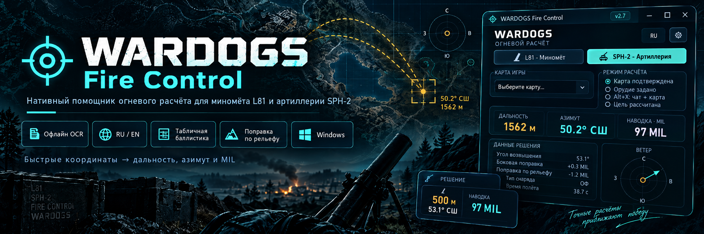
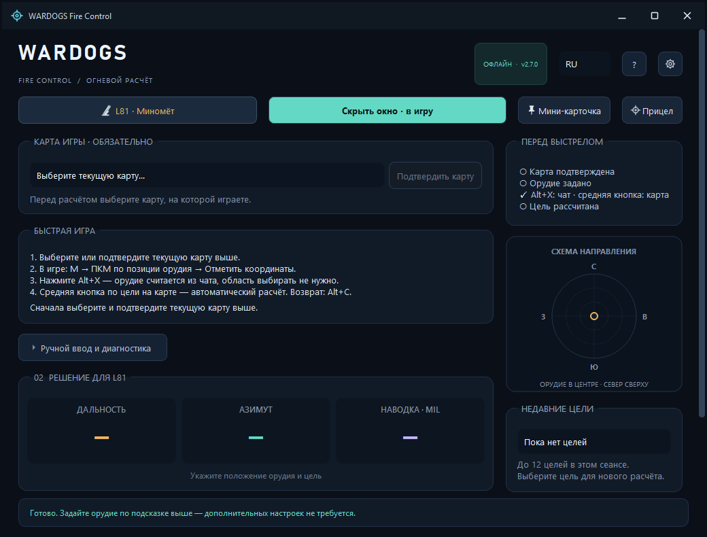
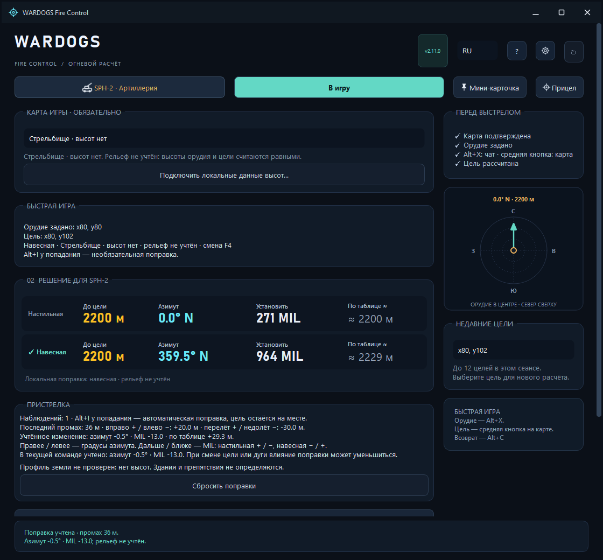
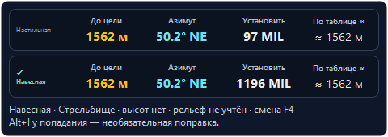
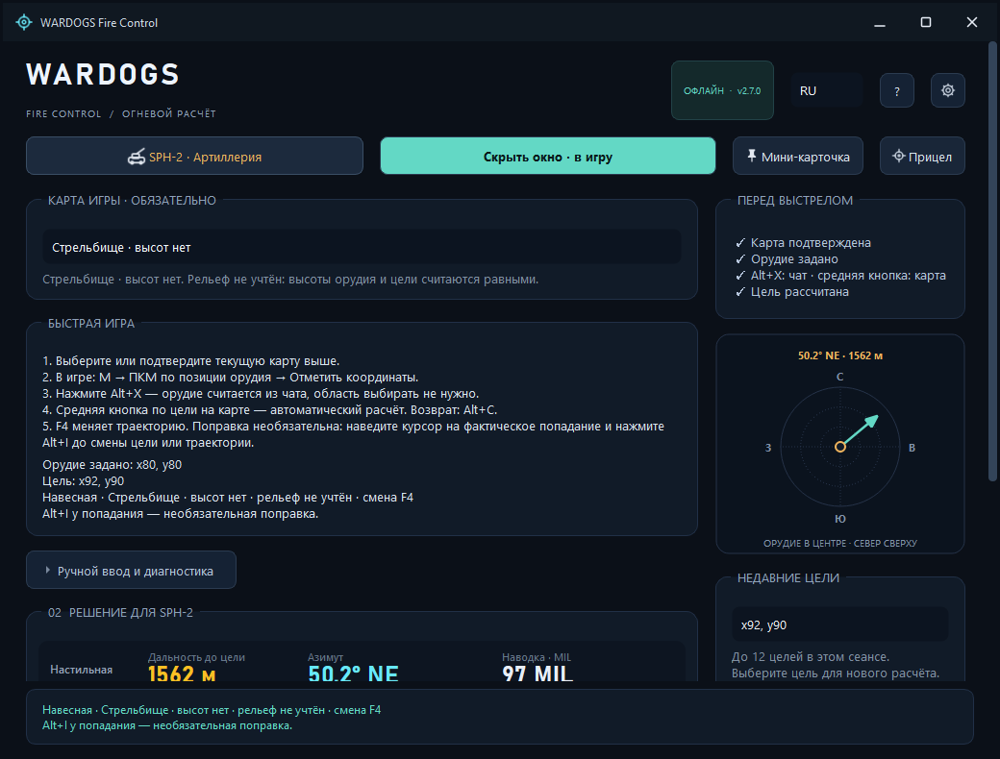
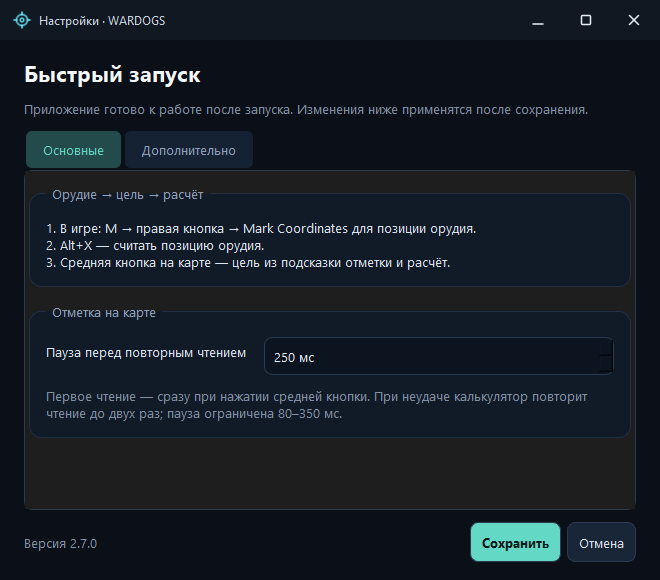
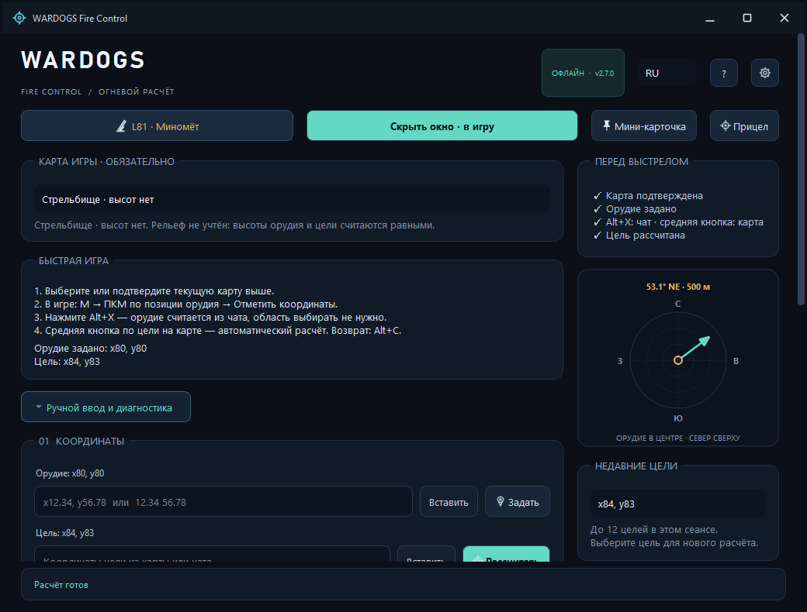
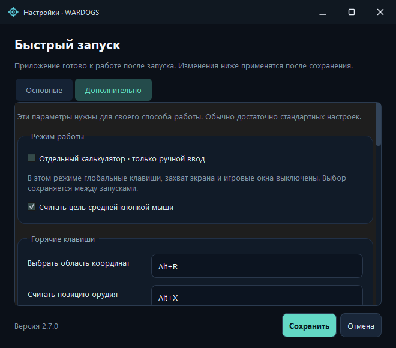
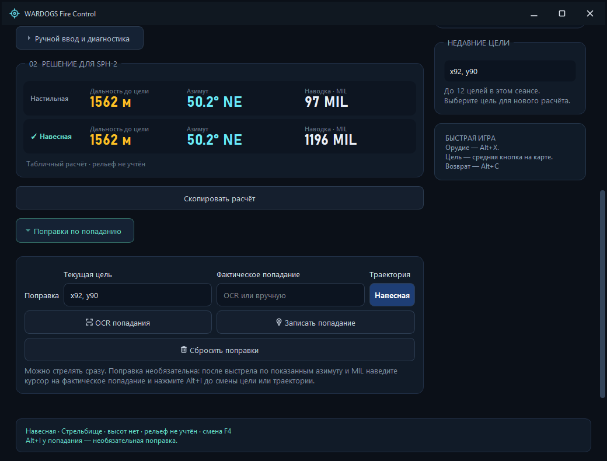
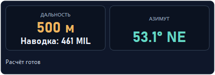

# WARDOGS Fire Control

**Нативный помощник для миномёта L81 и артиллерии SPH-2 в игре WARDOGS.** Координаты → дальность, азимут и MIL → наводка в игре.

**Русский** · [English](README.en.md) · [Скачать](https://github.com/sany86russ/Wardogs-Fire-Control/releases/latest) · [Инструкции](source/docs/QUICKSTART-RU.md) · [Сообщить о проблеме](https://github.com/sany86russ/Wardogs-Fire-Control/issues)

Программа помогает быстро перенести точки с карты в расчёт: **Alt+X** читает орудие из активного черновика чата, **средняя кнопка мыши** читает цель рядом с курсором на карте. Результат доступен в основном окне, мини-карточке поверх окон и на вспомогательном прицеле. Можно работать полностью вручную.

**Версия 2.8.0:** обновление из релизов GitHub прямо в программе. Проверка при запуске, баннер новой версии, загрузка с проверкой SHA-256 и обновление всего переносимого комплекта с перезапуском. Интерфейс и справка доступны на русском и английском; язык переключается без перезапуска.

**Исходники 2.11.0 — кандидат следующего релиза:** единый цикл **карта → Alt+X: орудие → средняя кнопка: цель → выстрел → Alt+I: попадание → уточнённая команда**. Стабильная загрузка выше пока ведёт на **2.8.0**; возможности кандидата доступны в сборке текущих исходников.

- **Пристрелка рядом с результатом:** последний принятый промах в метрах, уже учтённое изменение азимута/MIL, число наблюдений и сброс. Итоговые числа не требуют повторного прибавления поправки.
- **Одна выбранная команда:** главное окно, мини-карточка, прицел и Alt+I используют те же финальные азимут/MIL. Анализ другой дуги в дополнительных инструментах явно показан как исходный.
- **Три разные величины:** метры до цели, итоговый MIL и приблизительные метры по таблице сообщества; совпадение последних с текущим игровым RNG не обещается.
- **Автоматическая оценка земли SPH-2:** исходная выбранная модельная дуга, явные неизвестные высоты/неполное покрытие и предложение другой дуги без автопереключения. Здания, мосты и деревья не моделируются.
- **Принятые точки сохраняются:** до 64 последних позиций и целей, отдельно от 500 именованных записей. Имя необязательно; восстановление явно выполняется после подтверждения карты.
- **Дополнительные инструменты:** ручной перенос цели, сохранённые точки, собственные замеры времени, профиль земли и источники. Ручное попадание доступно в основном окне через «Ручной ввод и диагностика». Перенос точки не называется пристрелкой.
- **OCR и диагностика 2.10 сохранены:** поиск подписанных X/Y, согласие отдельных снимков, до четырёх кадров на запрос и ограниченный архив журналов.

Игровые скорость и гравитация не подтверждены; модель времени по умолчанию отключена. Alt+I не измеряет секунды полёта. Таблицы сохранены; соответствие текущей версии игры требует отдельной проверки. [Рабочий цикл 2.11](source/docs/USAGE-RU.md) · [Подробные расчёты](source/docs/CALCULATIONS-RU.md).

> Это неофициальная утилита сообщества для **игры WARDOGS**. Она не связана с BULKHEAD и не предназначена для реального оружия. Разрешение разработчика игры на OCR, горячие клавиши и наложения не подтверждено; отсутствие санкций не гарантируется. Перед использованием игровых функций ознакомьтесь с [ограничениями и правилами](source/docs/ANTICHEAT-RU.md).

## Содержание

- [Для чего нужна программа](#для-чего-нужна-программа)
- [Возможности](#возможности)
- [Скачивание и запуск](#скачивание-и-запуск)
- [Первый расчёт](#первый-расчёт)
- [L81 и SPH-2](#l81-и-sph-2)
- [Клавиши](#клавиши)
- [Язык и настройки](#язык-и-настройки)
- [Как работают расчёты](#как-работают-расчёты)
- [Карты и высоты](#карты-и-высоты)
- [OCR и проверка координат](#ocr-и-проверка-координат)
- [Локальные данные и приватность](#локальные-данные-и-приватность)
- [Скриншоты](#скриншоты)
- [Документация и сборка](#документация-и-сборка)
- [Ограничения и обратная связь](#ограничения-и-обратная-связь)
- [Происхождение и лицензии](#происхождение-и-лицензии)
- [Поддержать автора](#support)
- [Проблемы с подключением к WARDOGS](#проблемы-с-подключением-к-wardogs)

## Для чего нужна программа

- **Миномётный расчёт:** получить дальность, направление и табличный MIL для L81 по положению орудия и цели.
- **Артиллерия SPH-2:** сравнить доступные низкую и высокую траектории, выбрать одну для наводки и при желании уточнить её по фактическому попаданию.
- **Несколько целей с одной позиции:** задавать новую цель средней кнопкой, возвращаться к последним точкам и копировать результат для координации.
- **Тренировка и ручная работа:** вводить координаты без захвата экрана, проверять дальности и знакомиться с математикой на открытых исходниках.
- **Игра с двумя языками:** переключаться между RU и EN, сохраняя состояние расчёта.

Программа рассчитывает команду наведения. Выставление азимута и MIL, выбор момента выстрела и проверка результата остаются действиями игрока.

## Возможности

| Возможность | Что получает игрок |
|---|---|
| **L81** | Интерполяцию по 71 исходной точке, дальность 132–684 м, прицел 850–150 MIL |
| **SPH-2** | Две игровые таблицы, прямой расчёт по цели и выбор траектории |
| **Быстрый ввод** | Орудие из активного черновика чата и цель из подписей X/Y около курсора |
| **Локальный OCR** | Распознавание на CPU с моделью в комплекте; облачный сервис не нужен |
| **Проверка сомнительного чтения** | Просмотр найденных пар, исправление координат, явное принятие или отклонение |
| **Ручной режим** | Ввод и вставку координат; игровые функции можно отключить |
| **Мини-карточка и прицел** | Результат поверх окон, настройки прозрачности, размера и блокировки |
| **Пристрелка SPH-2** | Промах в метрах, изменение азимута/MIL, число наблюдений и сброс; поправка применяется к выбранной команде |
| **Рельеф SPH-2** | Локальные высоты и автоматическая оценка пересечений земли для выбранной исходной дуги; неизвестные данные показаны явно |
| **История и копирование** | До 12 целей сеанса, сохраняемые принятые позиции/цели с необязательными именами и копирование расчёта |
| **RU / EN** | Мгновенное переключение окон, кнопок, ошибок, подсказок и копируемого расчёта |
| **Обновления GitHub** | Проверку новой версии, описание релиза, проверенную загрузку и установку по кнопке |
| **Переносимый комплект** | Запуск из распакованной папки; SDK и Python для использования не нужны |

## Скачивание и запуск

**Требования:** Windows 10/11 x64. Для обычного запуска не нужны установка приложения, права администратора, Qt SDK, Visual Studio или Python.

1. Откройте [последний релиз](https://github.com/sany86russ/Wardogs-Fire-Control/releases/latest).
2. Скачайте **WardogsFireControl-v2.8.0-win-x64.zip** из раздела **Assets**.
3. **Распакуйте ZIP целиком** в отдельную папку.
4. Запустите **Запустить.cmd**, **Start.cmd** или **WarDogsDistanceCalculator.exe** внутри распакованного комплекта.

Не переносите один EXE без остальных файлов: программе нужны библиотеки DLL, папки <code>platforms</code> и <code>models</code>. Архивы GitHub **Source code (zip/tar.gz)** содержат исходники; для запуска готовой программы нужен ZIP из Assets.

Для мини-карточки и прицела используйте **оконный режим без рамки**. Наложения в exclusive fullscreen требуют проверки и могут быть недоступны.

### Проверка скачанного файла

Рядом с архивами релиза публикуется файл контрольных сумм SHA-256. Сравните указанную сумму с результатом:

~~~powershell
Get-FileHash .\WardogsFireControl-v2.8.0-win-x64.zip -Algorithm SHA256
~~~

Контрольная сумма проверяет целостность скачивания. При наличии GitHub CLI происхождение сборки можно дополнительно проверить через GitHub attestations:

~~~powershell
gh attestation verify .\WardogsFireControl-v2.8.0-win-x64.zip --repo sany86russ/Wardogs-Fire-Control
~~~

### Обновление из программы

Начиная с **2.8.0**, программа при запуске проверяет последний стабильный релиз в этом репозитории. Проверка идёт в фоне: при отсутствии интернета калькулятор продолжает работать. Её можно выключить в настройках; ручная кнопка **«Проверить обновления»** остаётся доступной.

Баннер новой версии предлагает **«Обновить»**, **«Что нового»** и **«Позже»**. Установка начинается только после нажатия «Обновить»: программа скачивает полный ZIP, проверяет размер, SHA-256 и файлы комплекта, закрывается, заменяет комплект и запускается снова. Загрузку можно отменить до установки. Настройки и импортированный рельеф в профиле Windows сохраняются; текущие координаты и история сеанса после перезапуска не сохраняются.

**Переход с 2.7.0 и более ранних версий:** один раз скачайте новый ZIP вручную и распакуйте целиком. Старые версии ещё не содержат механизма обновления. Для автоматической установки нужны полный комплект из Assets и право записи в его папку. При ошибке замены установщик восстанавливает предыдущие файлы; резервная копия и журнал остаются в папке <code>.wardogs-update-…</code>. Подробности, ограничения и ручное восстановление — [в инструкции](docs/UPDATES-RU.md).

OCR и расчёты выполняются локально. Интернет нужен только для проверки/скачивания обновлений и открытия внешних ссылок. Координаты, снимки и рельеф не отправляются на GitHub.

## Первый расчёт

### Быстрый игровой сценарий

1. В программе **выберите текущую карту**. При следующем запуске подтвердите сохранённый выбор. Карта обязательна перед расчётом.
2. Выберите **L81 · Миномёт** или **SPH-2 · Артиллерия**.
3. В игре откройте карту клавишей **M**, нажмите **ПКМ по положению орудия → Mark Coordinates / Отметить координаты**. Координаты появятся в поле чата; отправлять сообщение не нужно.
4. Нажмите **Alt+X**. Если единственная полная пара прочитана уверенно, программа принимает орудие и показывает мини-карточку.
5. Наведите курсор на цель на карте и нажмите **среднюю кнопку мыши**. Программа читает отдельные подписи X/Y у курсора и выводит расчёт.
6. Выставьте в игре **азимут и итоговый MIL выбранной команды** и сделайте выстрел. Для SPH-2 **F4** переключает выбранную доступную траекторию.
7. Для пристрелки SPH-2 наведите курсор на **фактическое попадание** на карте и нажмите **Alt+I**, пока прежние цель и траектория ещё выбраны. Итоговая команда уточнится для той же цели.
8. Выставьте обновлённые азимут/MIL. Для следующей цели используйте среднюю кнопку. **Alt+C** возвращает главное окно.

Основной сценарий включён по умолчанию. Выделять OCR-область, нажимать отдельную кнопку старта или подтверждать каждую уверенно прочитанную пару не требуется. Alt+X всегда ищет активный черновик чата, даже если вы сохранили собственную область.

Средний щелчок продолжает ставить маркер в самой игре. После принятия орудия чтение целей доступно и при главном окне, и при мини-карточке; Alt+C его не отключает. Для полного отключения выберите отдельный калькулятор, отключите среднюю кнопку в настройках или закройте приложение.

**После перемещения орудия задайте его положение заново.** При смене карты программа очищает координаты, историю и поправки. Название карты не извлекается из игры автоматически.

Цикл исходников **2.11**: **подтверждение карты → Alt+X: орудие → средняя кнопка: цель → выстрел → Alt+I: попадание → уточнённая наводка**. Запись попадания необязательна; первый расчёт доступен сразу. Подробное [руководство RU](source/docs/USAGE-RU.md) и [EN](source/docs/USAGE-EN.md) описывает пристрелку, сохранённые точки и дополнительные инструменты.

**Интерфейс кандидата 2.11 — единый цикл и пристрелка.** Снимок реального приложения из GitHub runner показывает демонстрационную цель на дальности **2200 м**.

### Ручной сценарий

Раскройте **Ручной ввод и диагностика**, введите координаты орудия и цели либо нажмите **Вставить**. Например:

~~~text
Орудие: x98.54, y110.33
Цель:   x101.72, y109.13
~~~

Для L81 это даёт горизонтальную дальность **339.888 м**, азимут примерно **110.7°** и **649.013 MIL**. В карточке дальность и MIL округлены: **340 м / 649 MIL**. Математика использует исходную точность координат.

Выберите **Настройки → Дополнительно → Отдельный калькулятор · только ручной ввод**, если нужен режим без глобальных клавиш, экранного захвата и игровых наложений.

## L81 и SPH-2

| Орудие / траектория | Исходных точек | Горизонтальная дальность таблицы | Игровой прицел |
|---|---:|---:|---:|
| **L81** | 71 | 132–684 м | 850–150 MIL |
| **SPH-2, низкая** | 59 | 1181–2629 м | 20–600 MIL |
| **SPH-2, высокая** | 80 | 735–2629 м | 610–1400 MIL |

Диапазоны SPH-2 относятся к исходным таблицам для ровной поверхности. При разнице высот доступность траектории зависит от модели и итогового значения прицела. Недоступное решение отображается явно.

**MIL — игровая шкала наведения, а не мили и не дальность в метрах.** Для выстрела используйте итоговый MIL выбранной траектории. Основное окно и мини-карточка разделяют **дальность до цели**, **итоговый MIL** и **приблизительную эквивалентную дальность по таблице сообщества**. Дальность до цели одинакова для обеих траекторий; метры по таблице описывают текущий MIL и могут отличаться после высотной поправки и пристрелки. Они не обещают совпадения с RNG текущей версии игры.

### Необязательное уточнение SPH-2 по попаданию

SPH-2 даёт решение сразу. Обязательных двух пробных выстрелов в разных направлениях нет.

1. Рассчитайте цель и выберите траекторию.
2. Сделайте обычный выстрел с показанными настройками.
3. **До смены цели или траектории** откройте карту, наведите курсор на фактическое попадание и нажмите **Alt+I**.
4. Программа уточнит наводку прежней цели. Компактный блок **ПРИСТРЕЛКА** показывает последний принятый промах в метрах, уже **учтённое изменение** азимута/MIL и число наблюдений. Изменение включено в итоговые числа; не прибавляйте его повторно. Ручной ввод фактического попадания доступен в главном окне: **Ручной ввод и диагностика → Поправки по попаданию**.
5. **Сбросить поправки** удаляет уточнения и сразу возвращает прямой расчёт.

Средняя кнопка на попадании заменит цель: для поправки используйте Alt+I. Программа не наблюдает сам выстрел и реальные настройки игрового прицела; запись относится к команде, показанной при начале захвата.

Главное окно, мини-карточка, прицел и запись Alt+I используют **одну выбранную итоговую команду**. Если в дополнительных инструментах просматривается другая траектория, её анализ явно обозначен как исходный и не подменяет команду, которой следует стрелять. После принятия попадания наводка обновляется для прежней цели; ручные кнопки переноса цели в дополнительных инструментах изменяют саму точку и пересчитывают задачу.

В подсказке пристрелки направление **левее/правее** выражено в градусах азимута; **ближе/дальше** — изменением MIL. Для движения дальше **низкая траектория увеличивает MIL**, а **высокая уменьшает MIL**. Пристрелка оценивает эти изменения по принятому попаданию; она не определяет физический наклон машины.

Поправки действуют для **той же траектории** рядом с записанной целью и плавно исчезают на расстоянии **50 м**. Повторные поправки не складываются без конца. Слишком далёкое или несовместимое попадание отклоняется; текущая наводка сохраняется. После перемещения машины задайте орудие заново; после изменения положения корпуса на прежней точке сбросьте поправки вручную.

**Мини-карточка SPH-2 в кандидате 2.11.** Здесь показан отдельный демонстрационный расчёт на **1562 м**: это другая цель, чем в основном снимке выше.

Исторический вид расчёта SPH-2 в версии 2.7:

## Клавиши

Это значения **по умолчанию**. При конфликте Windows приложение подбирает свободный вариант и показывает фактически зарегистрированные сочетания в интерфейсе.

| Действие | Клавиша |
|---|---|
| Прочитать орудие из активного черновика чата | **Alt+X** |
| Прочитать цель у курсора карты | **Средняя кнопка мыши** |
| Открыть главное окно | **Alt+C** |
| Выделить собственную область OCR | **Alt+R** |
| Прочитать цель из чата или своей области | **Alt+T** |
| Временно выделить строку и прочитать цель | **Alt+V** |
| Прочитать попадание для поправки SPH-2 | **Alt+I** |
| Переключить выбранную траекторию SPH-2 | **F4** |
| Разблокировать мини-карточку | **Ctrl+Alt+Q** |

Сочетания можно настроить. Если ни один допустимый вариант не зарегистрирован, приложение показывает ошибку; неполный набор клавиш не сохраняется.

## Язык и настройки

Переключатель **RU / EN** находится в шапке рядом с версией. Русский выбран по умолчанию; выбор сохраняется. Перевод встроен в EXE и не требует скачивания языковых файлов.

| Настройка | Для чего |
|---|---|
| **Основные** | Схема работы и задержка чтения после отметки на карте |
| **Дополнительно** | Отдельный калькулятор, средняя кнопка, горячие клавиши и собственная область |
| **OCR своей области** | Основная модель RapidOCR либо дополнительный Windows OCR |
| **Шаблон координат** | Простой проверяемый формат X/Y; можно восстановить стандартный шаблон |
| **Мини-карточка** | Прозрачность, блокировка и клавиша разблокировки |
| **Прицел** | Размер, прозрачность, поправка азимута и параметры экранного масштаба |

Задержка захвата по умолчанию — **250 мс**, настраиваемый диапазон — **0–2000 мс**. В кандидате 2.10 фактическая пауза до первого снимка средней кнопки не меньше **80 мс**, даже при нулевом значении. Это время ожидания подписей после щелчка, а не обещанная длительность всего распознавания.

Настройки хранятся в <code>%LOCALAPPDATA%\WardogsFireControl\settings.ini</code>. Если нового профиля нет, приложение может прочитать старый профиль <code>WarDogsDistanceCalculatorCpp</code>, сохранив изменения в новом месте. Выбранная вручную область привязана к физическому разрешению монитора; после смены разрешения выберите её заново.

## Как работают расчёты

Подробное описание численных методов и границ: **[CALCULATIONS-RU.md](source/docs/CALCULATIONS-RU.md)**. Все таблицы и алгоритмы находятся в [исходниках](https://github.com/sany86russ/Wardogs-Fire-Control/tree/main/source/src).

### Координаты, дальность и азимут

Одна единица игровых координат соответствует **100 м**. Для орудия (x₀, y₀) и цели (x₁, y₁):

~~~text
Δx = x₁ − x₀
Δy = y₁ − y₀
D  = 100 · √(Δx² + Δy²)                  [метры]
A  = atan2(Δx, Δy) · 180 / π mod 360      [градусы]
~~~

Азимут отсчитывается по часовой стрелке от севера: **0° — север, 90° — восток, 180° — юг, 270° — запад**. Результат нормируется в [0°, 360°). Дальность горизонтальная; высота не входит в длину отрезка на карте.

Дробные координаты сохраняются до расчёта; отображение округляется отдельно. NaN, бесконечности и переполнение отклоняются. История восстанавливает саму точку, а не округлённую подпись.

### Интерполяция игровых таблиц

Между соседними строками (D₀, M₀) и (D₁, M₁) применяется линейная интерполяция:

~~~text
MIL(D) = M₀ + (D − D₀) / (D₁ − D₀) · (M₁ − M₀)
~~~

За пределами поддерживаемой таблицы приложение не выдумывает MIL. У L81 допускается только машинная погрешность порядка 5·10⁻¹² м у границ 132 и 684 м; она не расширяет игровую дальность.

В высокой таблице SPH-2 есть два наблюдения на максимуме: **2629 м → 610 и 620 MIL**. При точном максимуме обратное преобразование выбирает первую строку **610 MIL**. Это свойство сохранённых данных, а не новая баллистика.

### Высотная модель SPH-2

При наличии совместимых данных высот приложение получает Δh = hцели − hорудия билинейной интерполяцией и решает приближённую траекторию с условной максимальной дальностью R = 2629 м:

~~~text
r = D / R
z = Δh / R
q = 1 − r² − 2z
tan(θlow)  = (1 − √q) / r
tan(θhigh) = (1 + √q) / r
~~~

В коде низкая ветвь вычисляется в алгебраически равносильной форме, устойчивой к потере точности. Угол преобразуется в эквивалентную дальность на ровной поверхности R·sin(2θ), затем обратно в **игровую таблицу MIL**. Игровой MIL не подставляется напрямую как физический угол запуска. Недостижимая цель или итог за пределами таблицы дают явный отказ.

Эта модель приблизительная. Для **L81 высотная модель не подтверждена и не применяется**.

### Локальные поправки по попаданию

Наблюдение сравнивает показанную команду с исходным расчётом для фактической точки попадания:

~~~text
δA   = wrap(показанный азимут − номинальный азимут попадания)
δMIL = показанный MIL − номинальный MIL попадания той же траектории
~~~

Из наблюдений оцениваются раздельные поправки азимута и MIL с учётом согласованности и расстояния до цели. Для принятия промах должен укладываться одновременно в **20% горизонтальной дальности** и **400 м**; дополнительно проверяются совместимость команды и доступность исправленной наводки. История ограничена **256 наблюдениями**.

Одно попадание не определяет трёхмерный наклон машины. Оценка согласованности не является вероятностью попадания.

### Автоматическая оценка земли и дополнительные инструменты

После принятия цели SPH-2 автоматически проверяет доступную поверхность вдоль **исходной модельной дуги выбранной траектории**. Результат различает оценочное пересечение земли, отсутствие найденного пересечения на проверенных точках, неизвестные высоты и неполное покрытие. Если другая доступная дуга выглядит предпочтительнее по этой оценке, приложение может предложить её; траектория **не переключается автоматически**.

Это не проверка фактического пути исправленного снаряда. Поправки Alt+I меняют команду наведения, но не превращаются в измеренную траекторию. Здания, деревья, мосты, крыши и высота ствола не представлены в наборе высот.

Окно **Дополнительные инструменты** объединяет ручной перенос цели, сохранённые точки, собственные замеры времени, профиль земли и источники таблиц. Перенос **левее/правее/ближе/дальше на 10/25/50/100 м** явно меняет координаты цели; это отдельное действие, а не запись попадания.

Принятые позиции и цели сохраняются с точными координатами по карте и орудию; имя необязательно. Восстановление выполняется явно после подтверждения карты. После запуска карта, орудие и прежние поправки автоматически не восстанавливаются.

Время между выстрелом и нажатием Alt+I **не является временем полёта**: включает реакцию игрока и работу с картой. Время доступно по подходящим собственным замерам либо отдельно включаемой физической модели. Модель скорости/гравитации по умолчанию отключена; её секунды обозначены как оценка.

## Карты и высоты

Карта **обязательна** и подтверждается каждый сеанс. Это предотвращает незаметное использование высот другой карты. Её смена очищает орудие, цель, историю и поправки.

- **Bakurani, Ozeti, Zestafona:** поддерживаются соответствующие совместимые локальные .wdt-пакеты.
- **Стрельбище / неизвестная карта:** явный режим **без высот**; орудие и цель предполагаются на одной высоте.
- **Данные не входят в публичный ZIP и репозиторий.** Программа не скачивает их автоматически. Импорт допускается только для уже имеющихся локальных файлов, на использование которых у вас есть необходимые права.
- При импорте проверяются SHA-256, идентификатор карты и геометрия. При чтении проверяются размеры и CRC блоков; точке за пределами покрытия не подставляется нулевая высота.
- Пакеты пользователя находятся в <code>%LOCALAPPDATA%\WardogsFireControl\terrain-packs</code> и сохраняются при обновлении переносимой папки программы.

Сетка данных — **2 м**, единица хранения высоты — **0,1 м**, метод между узлами — билинейная интерполяция. Это поверхность земли: мосты, крыши и высота ствола не представлены. Для стрельбища подходящего набора высот нет; другая карта не является заменой.

См. [происхождение данных и условия распространения](source/TERRAIN_DATA_NOTICE.md).

### Как отдельно подключить высоты

Совместимый архив **terrain-packs.zip** доступен в [оригинальном релизе Ricoz217 v1.4.0](https://github.com/Ricoz217/WarDogs_Distance_Calculator/releases/tag/v1.4.0): **[скачать terrain-packs.zip](https://github.com/Ricoz217/WarDogs_Distance_Calculator/releases/download/v1.4.0/terrain-packs.zip)**. Это внешний источник данных; для него действуют [условия правообладателей](source/TERRAIN_DATA_NOTICE.md). Устанавливать первоначальный калькулятор не требуется.

1. Скачайте архив самостоятельно и распакуйте его.
2. Найдите папку **terrain-packs**, содержащую **bakurani.wdt**, **ozeti.wdt** и **zestafona.wdt**.
3. В **главном окне** WARDOGS Fire Control, в блоке **Карта игры · обязательно**, нажмите **Подключить локальные данные высот…**.
4. Выберите распакованную папку **terrain-packs**. Программа проверит файлы и установит их в постоянный каталог пользователя.
5. Выберите и подтвердите **именно ту карту, на которой играете**. Для SPH-2 будет применяться разница высот; при смене карты задайте орудие и цель заново.

SHA-256 указанного архива:

~~~text
c511df32f956e9171ac79bf939e955ea7f2851a4c39bdad6f924e46c989ede49
~~~

Ссылка закреплена на проверенной совместимой версии **v1.4.0**. Новые или произвольно изменённые пакеты не следует считать совместимыми автоматически. После успешной установки всех трёх пакетов кнопка импорта скрывается; файлы пользователя сохраняются при обновлении приложения.

## OCR и проверка координат

Быстрый сценарий использует **PP-OCRv6_rec_small + ONNX Runtime на CPU**. Распознавание выполняется локально; основная модель включена в ZIP. Дополнительный Windows OCR относится к **своей области** и требует поддерживаемого английского OCR-пакета Windows. Выбор этого варианта не меняет основной захват чата и карты.

Alt+X ищет именно **активный черновик**, а не любую старую пару в истории чата. Для цели читаются **две отдельные подписанные оси X/Y** около курсора. Проверяются полнота, уверенность, согласие проходов и контекст окна. Слабое, обрезанное или неоднозначное чтение открывает проверку; прежняя наводка скрывается до разрешения ситуации.

В кандидате **2.10.0** исходные прямоугольники служат ориентиром для ограниченного поиска рядом с курсором. Число без полной подписи оси не применяется как X или Y; несколько конкурирующих пар требуют проверки. После средней кнопки первый снимок делается с задержкой, по умолчанию **250 мс**, чтобы игра успела показать отметку. Автоматическое принятие требует совпадающей уверенной пары из **двух отдельных снимков** при прежних курсоре, окне и геометрии. Один запрос ограничен **четырьмя кадрами**; повторная обработка одного кадра не заменяет второе наблюдение. Если игрок выбирает другую точку во время OCR, применяется актуальный захват; устаревший ответ не заменяет новую цель. **Непрерывного сканирования экрана нет.**

Если чтение не удалось:

1. Для орудия снова вызовите **Mark Coordinates** и проверьте видимость полной пары в поле чата.
2. Для цели удерживайте курсор возле подписей выбранной точки и повторите средний щелчок.
3. Резервный путь цели: **M → ПКМ по цели → Mark Coordinates → Alt+T**. Полная пара должна быть видна в активном черновике чата; отправлять сообщение не требуется. В **Настройки → Дополнительно** включите **Автопоиск для дополнительных захватов**, иначе Alt+T использует сохранённую собственную область.
4. Откройте игру на одном мониторе; окно WARDOGS должно быть активным и доступным для захвата.
5. Используйте ручной ввод, собственную область или исправление в карточке проверки.

Поиск остаётся внутри активного клиента игры и ограниченного окружения курсора. Основной движок карты — RapidOCR; автоматической подмены на другой OCR при ошибке нет. Для регрессий сохранены пять реальных пар X/Y и их преобразования; новые испытания стрельбы в игре не проведены. Поддержка каждого разрешения, оформления HUD и будущего обновления игры не обещается.

## Локальные данные и приватность

- Расчёты, OCR и чтение рельефа выполняются **на компьютере пользователя**.
- Для расчёта не нужны учётная запись, API-ключ или облачная подписка.
- Программа не читает память процесса игры, не внедряет DLL, не управляет прицелом и не выполняет выстрел.
- Экранный захват относится к области активного окна WARDOGS; это не доказательство допуска со стороны античита.
- Буфер обмена читается по нажатию **Вставить**, а не просматривается в фоне.
- Журнал текущего сеанса — <code>%LOCALAPPDATA%\WardogsFireControl\logs\latest.log</code>; предыдущего — <code>latest.previous.log</code>. В кандидате 2.10.0 до **32** более ранних журналов сохраняются в **latest.archive**. Размер каждого ограничен **4 МиБ**: до **128 МиБ** архивов и **8 МиБ** текущего и предыдущего файлов. При сбое файловой системы может остаться дополнительный recovery-файл до 4 МиБ; посторонние файлы не входят в этот лимит и не удаляются. Архив не сохраняет историю навсегда.
- Журналы содержат диагностику OCR и расчётов, но не снимки экрана. Они могут содержать игровые координаты и локальные пути: перед публичным вложением просмотрите содержимое.
- В исходниках 2.11 файлы **recent-fire-missions.json** (до 64 последних принятых точек), **fire-missions.json** (до 500 именованных записей), **flight-profiles.json** и **planning.ini** хранят точки, собственные замеры и параметры в профиле Windows рядом с настройками. Они остаются локальными, сохраняются при обновлении и не входят в архив программы.

## Скриншоты

Новые снимки **кандидата 2.11.0** получены из реального приложения на GitHub runner: основное окно показывает цель на **2200 м**, мини-карточка — отдельную цель на **1562 м**. Остальные изображения — исторические снимки **2.7.0**, сохранённые для обзора остальных окон. Демонстрационные значения не подтверждают точность игровых попаданий.

| Окно | RU | EN |
|---|---|---|
| Единый цикл и пристрелка · 2.11 | [Открыть](docs/screenshots/ru-fire-control-2.11.png) | [Open](docs/screenshots/en-fire-control-2.11.png) |
| Мини-карточка SPH-2 · 2.11 | [Открыть](docs/screenshots/ru-sph2-mini-2.11.png) | [Open](docs/screenshots/en-sph2-mini-2.11.png) |
| Главное окно · 2.7 | [Открыть](docs/screenshots/ru-main.png) | [Open](docs/screenshots/en-main.png) |
| SPH-2 · 2.7 | [Открыть](docs/screenshots/ru-vehicle.png) | [Open](docs/screenshots/en-vehicle.png) |
| Настройки · 2.7 | [Открыть](docs/screenshots/ru-settings.png) | [Open](docs/screenshots/en-settings.png) |
| Дополнительные настройки · 2.7 | [Открыть](docs/screenshots/ru-recognition.png) | [Open](docs/screenshots/en-recognition.png) |
| Ручной ввод · 2.7 | [Открыть](docs/screenshots/ru-manual.png) | [Open](docs/screenshots/en-manual.png) |
| Поправки по попаданию · 2.7 | [Открыть](docs/screenshots/ru-calibration.png) | [Open](docs/screenshots/en-calibration.png) |
| Компактное окно · 2.7 | [Открыть](docs/screenshots/ru-compact.png) | [Open](docs/screenshots/en-compact.png) |

Ручной ввод и дополнительные настройки

Поправки по попаданию и компактное окно

## Документация и сборка

| Документ | Содержание |
|---|---|
| [Быстрый старт RU](source/docs/QUICKSTART-RU.md) / [EN](source/docs/QUICKSTART-EN.md) | Запуск, координаты, игровой путь, клавиши, OCR и профиль |
| [Рабочий цикл 2.11 RU](source/docs/USAGE-RU.md) / [EN](source/docs/USAGE-EN.md) | Пристрелка, итоговая команда, сохранённые точки и дополнительные инструменты |
| [Математика RU](source/docs/CALCULATIONS-RU.md) / [EN](source/docs/CALCULATIONS-EN.md) | Таблицы, формулы, высоты, поправки и численные границы |
| [Архитектура RU](source/docs/ARCHITECTURE-RU.md) / [EN](source/docs/ARCHITECTURE-EN.md) | Модули, потоки, управление состоянием и технологии |
| [Взаимодействие с игрой RU](source/docs/ANTICHEAT-RU.md) / [EN](source/docs/ANTICHEAT-EN.md) | Экранный захват, hooks, ограничения и правила WARDOGS |
| [Изменения RU](source/docs/RELEASE-NOTES-RU.md) / [EN](source/docs/RELEASE-NOTES-EN.md) | История текущей версии и границы проверки |
| [Локализация](source/docs/LOCALIZATION.md) | Каталоги перевода, смена языка и проверки |
| [Сборка RU](docs/BUILD-RU.md) / [EN](docs/BUILD-EN.md) | Подготовка окружения, тесты и переносимый пакет |
| [Исходный код](source/) | Приложение, математика, OCR, переводы, инструменты и тесты |

Стек: **C++20, Qt 6.8+, MSVC x64, CMake 3.24+, Ninja, ONNX Runtime, C++/WinRT и Zstandard**. Основные модули: <code>calculator.cpp</code>, <code>vehicle_ballistics.cpp</code>, <code>continuous_calibration.cpp</code>, <code>ocr.cpp</code>, <code>terrain_package.cpp</code>, <code>main_window.cpp</code>.

Для сборки нужны Visual Studio 2022 с **Desktop development with C++**, Qt **MSVC x64** и CMake/Ninja. Из корня проекта:

~~~powershell
$env:QT_ROOT = 'C:\Qt\6.8.3\msvc2022_64'
.\Build.ps1
.\Build.ps1 -Package
~~~

Первая команда собирает проект и запускает CTest. Вторая дополнительно создаёт переносимую папку **App** и ZIP в **dist**. Параметр **-SkipTests** предназначен только для подготовки и не допускается вместе с обновлением пакета.

[GitHub Actions](https://github.com/sany86russ/Wardogs-Fire-Control/actions) выполняет сборку Windows и CTest; релизный workflow готовит переносимый ZIP, архив публичных исходников и SHA-256. Результат конкретного запуска виден в Actions и на странице релиза.

Репозиторий содержит исходники приложения, тесты, модель OCR, используемые компоненты и лицензионные уведомления; Qt SDK и Visual Studio устанавливаются отдельно для разработки. Исходники соответствующей Qt в релизе доступны отдельными архивами для соблюдения LGPL.

## Ограничения и обратная связь

Программа не моделирует ветер, разброс и движение цели. Время доступно по собственным замерам или отдельно включаемому предположению; дуга и проверка поверхности приближённые, без зданий, мостов и деревьев. Высотная модель SPH-2 приближённая; для табличной наводки L81 высотной поправки нет. Сохранённые таблицы сообщества могут отличаться от показаний текущей игры. Новый рабочий цикл не меняет таблицы и не подтверждает точность попаданий. Точность первого выстрела и процент попаданий не гарантируются.

Автоматические проверки охватывают расчёты, крайние значения, OCR на контрольных снимках, отказ без порчи состояния, рельеф, настройки и локализацию. Проверка интерфейса 2.7.0 включала RU/EN и масштабы Windows 100/150/200%. Эти результаты подтверждают программные сценарии; они не заменяют серию игровых выстрелов, испытание всех HUD или решение разработчика о допустимости утилиты.

Если обнаружили проблему, создайте [Issue](https://github.com/sany86russ/Wardogs-Fire-Control/issues). Укажите:

- Версию программы, Windows, язык и масштаб экрана.
- Орудие, карту, разрешение игры и оконный режим.
- Шаги воспроизведения, ожидаемый и фактический результат.
- Координаты, выбранную траекторию и при необходимости проверенный вами фрагмент журнала.

Для дефекта OCR полезен обрезанный снимок самих подписей X/Y без личной переписки. Не прикладывайте пароли, ключи, личные данные и посторонние журналы.

## Происхождение и лицензии

WARDOGS Fire Control развивает открытый MIT-проект **Rico217 / Ricoz217 — [WarDogs_Distance_Calculator](https://github.com/Ricoz217/WarDogs_Distance_Calculator)**. Основа — версия **v1.4.0**, commit <code>e1e14b2df5e59b6452a7aba105c36711b355d954</code>. Сохранены авторство, лицензия и [первоначальная документация](source/docs/README-UPSTREAM.md).

Развитие SoNiX: самостоятельный переносимый запуск, игровой путь чтения координат, проверка OCR, локальные поправки SPH-2, работа с рельефом, новые окна и полная локализация RU/EN. Точные исходники исследованной сторонней модификации EXE недоступны; побитовое тождество с ней не заявляется.

- **Код приложения:** [MIT](source/LICENSE).
- **Таблица L81:** [apollyon-sys/wardogs-calculator](https://github.com/apollyon-sys/wardogs-calculator), данные сообщества.
- **Таблицы SPH-2:** наблюдения [wardogs.t0ki.cn](https://wardogs.t0ki.cn/js/data.js), сохранённые в исходной основе.
- **Qt:** динамическое связывание, LGPL-3.0; **ONNX Runtime:** MIT; **модель PaddleOCR:** Apache-2.0; **Zstandard:** BSD-3-Clause. См. [сторонние компоненты](source/THIRD_PARTY_NOTICES.md).
- **Данные игры и рельефа:** принадлежат соответствующим правообладателям и не перелицензируются под MIT. См. [уведомление о данных карт](source/TERRAIN_DATA_NOTICE.md).

WARDOGS и связанные обозначения принадлежат их правообладателям. Программа не является официальным продуктом BULKHEAD.

## Поддержать автора

Если WARDOGS Fire Control оказался полезен, вы можете поддержать разработку SoNiX. Поддержка добровольная; приложение доступно без оплаты.

### Bitcoin (BTC)

**Сеть: Bitcoin**

~~~text
1GFcHvGPchDf6fgAqqtyZrEkFbVcrnWFgQ
~~~

### USDT

**Сеть: Tron (TRC20)**

~~~text
TEByALUzbYKWCYvyKPiAKrErs8ba6gc4Bo
~~~

Перед переводом проверьте адрес и сеть. Для USDT используйте **Tron / TRC20**.

## Проблемы с подключением к WARDOGS

У автора есть ещё один открытый проект — **[StabiLink Desktop](https://github.com/sany86russ/StabiLink-Desktop)**.

Если соединение с WARDOGS нестабильно или игра недоступна из вашей сети, посмотрите возможности StabiLink и его инструкции. Он может помочь с некоторыми сетевыми ограничениями; результат зависит от причины проблемы, провайдера и настроек. Это отдельная программа, для работы калькулятора она не нужна.
