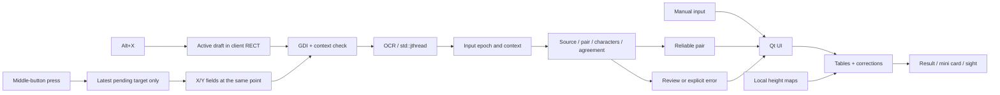

# WARDOGS Fire Control — architecture and development

The **2.11.0 candidate** unifies map confirmation, accepted gun/target coordinates, the selected final command and ranging. Automatic ground assessment and a separate accepted-point history are added; 2.10 OCR and diagnostic archives remain. The published stable release is **2.8.0**. This describes source rather than establishing publication or a new successful CI run.

**firing_analysis** separates table aiming from geometric arcs, assumed physics and measured time. **fire_missions** stores up to 500 named points and separately up to 64 recently accepted points using locking, a strict versioned JSON schema and atomic writes while preserving exact double coordinates. **planning_dialog** provides additional tools: manual target shifting, ground plots, explicit point restoration and timing observations; the main state owner checks map/weapon again and applies points through the shared manual path with OCR epoch advancement. Parameters and observations live in the user profile outside the portable application's manifest.

A native assistant for L81 and SPH-2 in **the game WARDOGS**. It works with manual coordinates, an active chat draft and two coordinate fields near the map cursor. It displays distance, bearing, MIL, both SPH-2 arcs and corrections from recorded impacts. Recognition and user map packages work locally. BULKHEAD approval has not been obtained; see the [game interaction audit](ANTICHEAT-EN.md).

The interface supports Russian and English. Russian is the default; the header selector beside the version switches immediately and saves the preference. Language changes preserve input and calculation state. See the [language guide](LOCALIZATION.md).

## Main workflow

**Confirm map and enter game** explicitly confirms the selected map through the usual checks and enters game mode; once confirmed, the button is **To game**. Without a selection, the interface directs the player to the map selector; missing required heights block calculation and entry. Alt+X accepts the gun; middle-click accepts a target; optional Alt+I records an actual impact before the target/arc changes. Refinement keeps the original target.

The main window, mini card, sight and Alt+I context use one selected final command; analysis of the other arc in additional tools is explicitly labeled as baseline. Results distinguish horizontal target range, final MIL and approximate inverse community-table range. Table metres are not represented as current game RNG.

**RANGING** shows the latest miss, already **applied bearing/MIL change**, observation count and reset. This change is included in final values. Manual impact entry is under **Manual input and diagnostics → Impact corrections**. Shifting the target itself is in additional tools and does not create an observation.


Game features and middle-button capture are enabled by default. **M → right-click → Mark Coordinates → Alt+X** always sets the gun through automatic detection of the active chat draft, independently of a saved manual region. A complete confident pair with a confirmed visual source is applied immediately; the application shows the mini card. A physical middle-button press sets the target from two fields near the map cursor when integration and mouse capture are enabled and the gun is accepted. This state does not depend on the visible window, `game_mode_` or returning with **Alt+C**. A new unaccepted gun capture blocks new targets using the old position. Conflicts display the combinations actually registered. Selecting a region, pressing Start game and confirming an ordinary successful reading are unnecessary.

`quick_workflow_version=1` marks the new workflow. Loading a profile without the marker or with a lower value enables the three default parameters and assigns gun/return shortcuts while accounting for internal conflicts; other actions retain their assignments. After the new profile is written, an explicit choice to disable game features is retained. **Manual input and diagnostics** expands separately; a custom workflow is configured in **Advanced**.

Automatic chat detection is limited to the upper-left quarter of WARDOGS' client RECT. Single-monitor bounds and foreground HWND are checked before and after capture. The detector identifies rows from white/green text components, separates the active white channel block from history and counts visible characters. An incomplete active draft is not replaced with an older complete pair from history. Automatic gun acceptance requires an active-draft source, one complete pair, agreement between passes, sufficient confidence, no clipping and matching character counts.

`make_map_coordinate_rects` retains the original physical-pixel hints: lower/right X — `(20,-46)..(160,12)`; upper Y — `(-12,-120)..(140,-52)`. In 2.10, `make_map_coordinate_search_rects` includes them in a bounded cursor neighborhood, normally `(-192,-224)..(288,128)`, scaled by client height relative to 1080 and clamped to 0.5–4. The area stays within the **client RECT**; a cursor outside the client, impossible size and overflow are rejected. Search is limited to 4096 pixels per side and 4 million pixels. Hints affect processing order but do not replace axis-label recognition.

Each frame is **one GDI screenshot** of the bounded area containing both axes. The same HWND, cursor and client geometry are checked before and after it. `recognize_map_neighborhood` examines eligible rows, requires complete X/Y labels with two decimal places, and checks visible-character counts and pass agreement. An unlabeled number does not become a coordinate by position; a competing second axis, damaged label or incompatible pair geometry is rejected. The entire interface is not searched, middle-button capture does not use old chat, and map recognition has no silent engine fallback.

A physical middle-button press pins client geometry at the click and first schedules a frame through a Qt timer: 250 ms by default, at least 80 ms. A geometry change during that delay cancels capture. `MapCaptureConsensus` accepts a pair only after two agreeing trustworthy **separate screenshots**, with at most four frames per request. Recognizing one image again checks OCR, rather than adding a vote. Conflicting trustworthy pairs require review; changes to cursor, window, geometry or epoch stop the old request. While OCR is busy, only the latest pending event is retained. The active-draft target fallback is **M → right-click → Mark Coordinates → Alt+T** when `automatic_chat_region` is enabled; otherwise the custom region is used. A failed or cancelled Alt+I restores the unchanged previous SPH-2 target's calculation through `restore_failed_impact_guidance`; an epoch mismatch or pending review prevents restoration. Cancellation records no new impact.

## Provenance and compatibility

Based on [Rico217 / Ricoz217's MIT project](https://github.com/Ricoz217/WarDogs_Distance_Calculator), tag `v1.4.0`, commit `e1e14b2df5e59b6452a7aba105c36711b355d954`. Attribution and the license are preserved. Further workflow, reliability and interface development by SoNiX. This is a standalone build from published source; bit-for-bit equivalence to earlier third-party EXEs is not claimed. See the [coordinate workflow sources, in Russian](COORDINATE-WORKFLOW-RESEARCH-RU.md).

| Feature | 2.11.0 candidate implementation |
| --- | --- |
| Manual gun and target coordinates | Original author's parser; explicit gun-not-set state; a real `(0,0)` point is allowed |
| Range, bearing and compass directions | One game unit equals 100 m; NaN/Inf/overflow protection |
| L81 | Preserved table interpolation and range; MIL is not invented outside the limits |
| Screen coordinates | Physical client RECT, bounded chat/map fields, monitor/window-context checks; optional custom region |
| Main OCR | PP-OCRv6_rec_small + ONNX Runtime CPU; row components, pair provenance, character count and pass agreement |
| Alternative OCR | Windows.Media.Ocr for a custom region; a supported English Windows OCR language pack is required. Automatic chat/map capture uses RapidOCR |
| Middle button and window presentation | Physical press; target from two axis labels near the cursor; bounded queue/retries; ready after gun acceptance regardless of the mini card; Alt+C opens the main window |
| Hotkeys | RegisterHotKey with MOD_NOREPEAT; occupied shortcuts receive a limited replacement, incomplete sets roll back |
| Compact card | Above other windows; size/opacity/lock; shortcut and taskbar unlock; return to calculation |
| SPH-2 | Original author's tables, low and high arcs, corrected aiming calculation |
| SPH-2 ranging | Direct calculation, optional Alt+I for the same target/arc, compact miss and applied changes, shared final result and reset |
| Terrain | Required map selection; SHA-256/mapId, local atomic import, persistent user directory; heights for both SPH-2 arcs and impact; explicit training-ground mode without heights |
| Sight | L81/SPH-2 scales, arc selection, bearing correction, size, opacity, DPI and 4:3 |
| Diagnostics | Main-window snapshots and the full path through an own test window; diagnostic modes do not write settings |
| Convenience | RU/EN, direction plot, 12 session targets, up to 64 recent accepted points separate from 500 named records, explicit restoration, clipboard and tray |

## Technologies

| Component | Role |
| --- | --- |
| C++20, MSVC 14.44, Windows x64 | Native logic, bounded background work, Win32 API |
| Qt 6.8.3 Widgets | Windows, layouts, QSS, events, QPainter, clipboard |
| ONNX Runtime 1.29.0 | Local CPU recognition of coordinate rows |
| C++/WinRT, Windows.Media.Ocr | Alternative system recognition |
| GDI, USER32, DWM | Region capture, monitors, mouse events, overlays |
| BCrypt, Zstandard 1.5.7 | Height-map verification and decoding |
| CMake 3.24+, Ninja, CTest, PowerShell | Build, checks and portable package |

Qt is dynamically linked. Python is used to check and update translation catalogs; it is unnecessary for ordinary application use. Original and third-party licenses are retained. Map data carries `TERRAIN_DATA_NOTICE.md`; it does not become the fork's property.

The distributable does not contain community `.wdt` files. Previously obtained local packages are verified and installed in `%LOCALAPPDATA%/WardogsFireControl/terrain-packs` and survive App updates. A valid App package takes precedence, then a user package; damaged files are not treated as ready data. Copied bytes are checked before atomic publication of the local file. The current map name is not extracted from the game: the player selects it and confirms the previous selection at launch. See `TERRAIN_DATA_NOTICE.md`.

## Main modules

| File / class | Responsibility |
| --- | --- |
| `src/app.cpp`, `run_application` | DPI/WinRT/Qt, single instance, launch commands, diagnostics |
| `src/main_window.cpp`, `MainWindow` | Coordinates, UI transitions, OCR jobs, game context, calibration, tray |
| `calculator.cpp`, `coordinates.cpp`, `presentation.cpp` | Coordinates, range/bearing, L81, formatting |
| `vehicle_ballistics.cpp` | SPH-2, two arcs, elevation, two-point ranging |
| `continuous_calibration.cpp` | Impact observations and correction refinement |
| `ocr.cpp`, `RapidOcr` | Text components, BGR preparation, ONNX, CTC, pair/source validation |
| `windows_ocr.cpp`, `WindowsOcr` | WinRT threads, high-contrast attempt, cancellation and timeout |
| `capture.cpp`, `SelectionOverlay` | Client-field/monitor geometry, GDI screenshot, selection and cancellation |
| `hotkeys.cpp`, `GlobalHotkeyListener` | RegisterHotKey, WM_HOTKEY, conflicts and shortcut release |
| `mouse_trigger.cpp`, `GlobalMouseListener` | Fast hook, event queue outside the hook, shutdown |
| `settings.cpp`, `AppSettings` | Workflow migration, parameter validation, INI import, atomic write |
| `terrain_package.cpp`, `TerrainPackage` | SHA-256, geometry, reflected Y axis, Zstd, heights and cache |
| `logger.cpp` | Bounded log, rotation and explicit write-failure signal |
| `PinnedResultWindow`, `GhostReticleWindow` | Card and sight above the game |
| `SettingsDialog`, `WindowTitleBar`, `VehicleSolutionWidget`, `DirectionPlot` | Settings, window controls, results and direction plot |
| `localization.cpp`, `translations/*.json` | Embedded RU/EN messages, UI translation and language changes |


## Threads and state

For SPH-2, `effective_vehicle_arc` selects one available arc from the F4 preference. The sight, card selection marks and `capture_impact_context` use it. In the automatic game workflow, Alt+I creates an ordinary two-map-field job with action `calibration_impact`; the snapshot contains X/Y of one point and the target is unchanged. Every optional impact retains the target, effective arc, commanded bearing/MIL and target elevation. There are no mandatory initial shots or stage number. This is impact-reading context, not automatic shot observation.

Middle-button retries are allowed only for the target action. An impact-reading error suggests repeating its shortcut; it does not turn into a new target. Changing terrain invalidates the epoch even before the first shot. Local correction publishes a complete verified candidate and preserves the previous model/history on rejection; the global matrix is not re-estimated from one direction.



Only the Qt thread modifies UI. OCR runs in `std::jthread`; `busy_` prevents parallel jobs and the middle-button queue retains at most one latest target. Results arrive through `QPointer` and queued invocation. `input_epoch_` rejects a result made stale by a new target, manual edit, mode or settings change; a separate epoch protects ranging. Checks run again when a corrected pair is applied.

`assess_ocr_result` lists pairs from both passes. An ambiguous/clipped pair, disagreeing passes, a weak character or unconfirmed visible-character count requires review. Score 0.90 and minimum character 0.65 thresholds are heuristics, not hit probabilities. Windows OCR provides neither scores nor visual confirmation of the active draft. Automatic gun acceptance requires a confirmed draft; manual result application remains a separate action. Previous aiming is hidden during new reading, unresolved uncertainty and errors. Rejecting review explicitly restores the previous result.

The UI uses COM STA for Qt's native clipboard. Windows OCR retains a COM MTA lease while its engine and unfinished callbacks exist; each worker thread initializes WinRT separately. The STA requirement was checked against [Qt 6.8](https://doc.qt.io/qt-6.8/windows-issues.html#ole-initialization).

RegisterHotKey receives only registered combinations on its own message thread and reserves them in Windows. Only `ERROR_HOTKEY_ALREADY_REGISTERED` allows up to three replacements with extra Ctrl/Shift for the same key. Requested and already selected actions are excluded; other errors or exhausted alternatives release the entire set. The UI saves and displays actual shortcuts, including card unlock. F12 and Win combinations are rejected.

The mouse hook forwards events. Movement does not start OCR; injected clicks are rejected; capture/recognition occur outside the hook. Reading readiness depends on enabled integration, the mouse setting and an accepted gun position. The mini card, `game_mode_` and Alt+C do not control that readiness; selecting standalone mode or disabling the mouse releases the hook. A new unconfirmed gun capture prevents new targets being read from the old gun position. The gate uses caption/class and excludes the application's own PID; this does not authenticate a process. Own code does not open another process or read its memory/path. Own windows and overlays are hidden before capture. Selection cancellation has one shared path, including Escape, right-click, WM_CLOSE and return. Qt dependencies are covered separately in `ANTICHEAT-EN.md`.

Closing requests OCR cancellation and releases hooks. Windows OCR has a three-second wait limit; after cancellation a new call receives a new engine while the old resources remain with its completion. At most two active/cancelled unfinished providers are held simultaneously, including during settings changes; stop-aware waiting is limited to 100 ms, followed by an explicit error. ONNX receives a terminate signal. Aiming and firing are not automated; the gun is not considered set before coordinates are obtained.

## Automatic analysis and saved points

For a ready SPH-2 target, <code>cache_automatic_analysis</code> obtains baseline arc analysis without assumed speed/gravity or Alt+I timing. The cache is keyed by accepted gun, target, map and loaded terrain. The UI reports selected baseline-arc ground assessment: intersection, no crossings at sampled points, unknown heights or incomplete coverage. Another arc may be suggested, but F4 selection is not changed automatically. Buildings and actual corrected flight are not analyzed.

<code>PlanningContext</code> supplies additional tools with current <code>active_solution</code>/<code>active_arc</code> only while guidance is ready: the command actually shown, including Alt+I. The baseline model arc and time remain separate analysis rather than measured flight of the corrected shot.

<code>remember_accepted_point</code> records accepted points only with a confirmed map; diagnostic mode does not change the profile. Separate <code>recent-fire-missions.json</code> stores up to 64 recent points. Repeating the exact pair in the same context moves it to the front; the cap removes only the oldest records from this history, never the up-to-500-record named collection <code>fire-missions.json</code>. Both stores validate format, lock and write atomically. Saving failures are reported explicitly.

User names are optional for automatic history. Restoration remains explicit after map/weapon checks; launch does not automatically restore the map, gun or ranging corrections. The exact saved Point is not recovered from a rounded label. [User workflow](USAGE-EN.md).
## Resources and storage

- The ONNX engine and model are not created for each capture; the input buffer and `MemoryInfo` are reused. CTC is decoded from the tensor. Images are limited to 16 megapixels; normalized row width is 4096. Component, row and variant counts are bounded; no whole-image flood-fill queue is used.
- GDI and COM are released through RAII. Full images are not retained between jobs. The middle button starts one bounded request with at most four separate frames seeking two agreeing observations; there is no continuous OCR/key polling.
- Ranging history is limited to 256 records without silent deletion; a new record validates its solution before commit. Nearby-target weighting is bounded separately for each arc; the proximity matrix is calculated once per pair.
- The high-arc table is sorted once. Terrain is decoded by blocks with an eight-block cache; LRU uses `list::splice`, and grid reconstruction is in place.
- The standard coordinate parser is linear. Custom regex permits a restricted language; a damaged ANSI version of the standard pattern is repaired automatically.
- `latest.log` and `latest.previous.log` are each limited to 4 MiB, up to 8 MiB combined. Before replacing the previous file, its bytes are published atomically as `latest.archive/session-<20-digit sequence>.log`; the nominal limit is 32 managed archives of 4 MiB each, up to 128 MiB combined. Previous bytes are not replaced until archiving completes. Unrecognized files, directories, hard links and reparse points are not deleted and are outside the managed limit; a transaction or failure may retain one additional staging/recovery file of up to 4 MiB, with errors reported explicitly. Messages are up to 4096 bytes, UTF-8, with control characters escaped. OCR completion, L81/SPH-2 calculations, impacts and WARN/ERROR/rotation/shutdown flush immediately; intermediate INFO records are buffered. OCR records distinguish X/Y, frame agreement and rejection reasons without screenshots or chat text. `session_log_healthy()` and a fixed `OutputDebugStringW` indicate failure without sending log text to the debugger.
- Saving ANSI INI converts a temporary copy to UTF-16LE with BOM and atomically replaces the profile; additional sections/keys/comments are retained. ANSI in the current code page and UTF-16LE are supported, with an 8 MiB limit. An unsupported encoding/exceeded limit does not replace the previous profile. An old imported profile is not written.

Historical local diagnostic receipts are excluded from the public repository. They do not promise current FPS, recognition time or freedom from long-term leaks. The first OCR call includes loading the model and differs from a warmed call.

The 2.10 regressions use five retained real X/Y pairs, scale/position transformations, synthetic competing labels and an own test window. This checks known inputs and the software path. New in-game firing trials have not been performed. OCR and journal changes do not change ballistic tables or the physical model; first-shot accuracy and any hit percentage are not guaranteed.

## Development commands

From the project root:

```powershell
.\Build.ps1
.\Build.ps1 -Package
.\Build.ps1 -Package -SkipArchive
.\Launch.ps1
```

Normal builds are sequential and run CTest. For preparation while playing, `source/tools/prepare-low-priority.ps1` uses Idle and one process, defers tests and does not replace the running App. `Build.ps1 -SkipTests` allows preparation but blocks a `-Package` update. Normal packaging includes Qt, Microsoft VC Runtime, ONNX, the model, licenses and guides; it verifies ZIP length and SHA-256 before replacing App. The previous package is retained in `.recovery/releases`; the user's height-data directory is not removed.

Check the translation catalogs from the `source` directory:

```powershell
py -3.11 tools/check_localization.py
```

Diagnostics: `--self-test=path.json --test-image=path.png`. Snapshots: `--ui-snapshot`, `--manual-ui-snapshot`, `--compact-ui-snapshot`, `--vehicle-ui-snapshot`, `--pinned-ui-snapshot`, `--review-ui-snapshot`, `--settings-ui-snapshot`, `--tutorial-ui-snapshot`, `--notice-ui-snapshot`. `--unlock-pinned` signals the running instance.

## Checks and evidence limits

CTest covers coordinates/L81, SPH-2, calibrations, damaged packages, the sight, settings/write failures, hotkeys, mouse, GDI, Qt and OCR. Supplied cropped images check the active draft and axis labels; an own native window checks Windows capture. Geometry is checked for 1080/1440/4K, negative monitor coordinates, boundaries and overflow. Test images and an own window do not prove recognition of a live WARDOGS marker. A separate [game-log investigation, in Russian](COORDINATE-SOURCES-INVESTIGATION-RU.md) was performed at SoNiX's request: no confirmed file stream of points was found; the working path does not watch game files.

Public results of new builds are available in GitHub Actions. Historical local logs and original user screenshots are not published. Terrain hashes establish integrity, not redistribution rights. Software checks do not replace a match: live coordinate fields, overlays in exclusive fullscreen and hit accuracy require in-game verification. Use borderless windowed mode for overlays; the elevation model is approximate. After moving SPH-2, set the gun again; after changing hull orientation or weapon, reset local corrections.

The author's experimental fitted-drag model v1.4.1 was not carried over: game measurements are insufficient to replace compatible tables and corrections.
