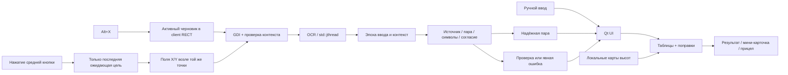

# WARDOGS Fire Control — устройство и развитие

Кандидат **2.11.0** объединяет подтверждение карты, принятие орудия/цели, выбранную итоговую команду и пристрелку. Добавлены автоматическая оценка земли и отдельная история последних принятых точек; OCR и архив диагностики 2.10 сохранены. Стабильный опубликованный релиз пока **2.8.0**. Это описание исходников, а не подтверждение публикации или новой CI-проверки.

Модуль **firing_analysis** отделяет табличную наводку от геометрической дуги, предположенной физики и измеренного времени. **fire_missions** хранит до 500 именованных точек и отдельно до 64 последних принятых точек через блокировку, строгую версию JSON и атомарную запись, сохраняя точные double-координаты. **planning_dialog** предоставляет дополнительные инструменты: ручной перенос цели, график поверхности, явное восстановление точек и замеры; основной владелец состояния повторно проверяет карту/оружие и применяет точки через общий ручной путь с обновлением эпохи OCR. Параметры и замеры находятся в профиле пользователя, вне манифеста переносимого приложения.

Нативный помощник для L81 и SPH-2 в **игре WARDOGS**. Работает с ручными координатами, активным черновиком чата и двумя полями координат около курсора карты. Показывает расстояние, азимут, MIL, обе траектории SPH-2 и поправки после пристрелки. Распознавание и пользовательские пакеты карт работают локально. Одобрение BULKHEAD не получено; [проверка взаимодействия с игрой](ANTICHEAT-RU.md).

Интерфейс поддерживает русский и английский языки. Русский используется по умолчанию; переключатель рядом с версией меняет язык сразу и сохраняет выбор. Координаты и состояние расчёта сохраняются. См. [памятку о языке](LOCALIZATION.md).

## Основной сценарий

Кнопка **Подтвердить карту и в игру** явно подтверждает выбранную карту через обычные проверки и затем выполняет переход; после подтверждения это **В игру**. При отсутствии выбора интерфейс направляет к выбору карты, а отсутствие обязательных высот блокирует расчёт и переход. Alt+X принимает орудие; средняя кнопка принимает цель; необязательный Alt+I записывает фактическое попадание до смены цели/дуги. Уточнение относится к прежней цели.

Главное окно, мини-карточка, прицел и контекст Alt+I используют одну выбранную итоговую команду; анализ альтернативной дуги в дополнительных инструментах явно подписан как исходный расчёт. Результат разделяет горизонтальную дальность цели, финальный MIL и обратную приблизительную дальность по таблице сообщества. Табличные метры не объявляются текущим игровым RNG.

Блок **ПРИСТРЕЛКА** показывает последний промах, уже **учтённое изменение** азимута/MIL, число наблюдений и сброс. Это изменение уже включено в финальные значения. Ручное попадание доступно через **Ручной ввод и диагностика → Поправки по попаданию**. Перенос самой цели находится в дополнительных инструментах и не создаёт наблюдения.


Игровые функции и средняя кнопка включены по умолчанию. **M → ПКМ → Mark Coordinates → Alt+X** всегда задаёт орудие из автоматического поиска активного черновика чата, независимо от сохранённой ручной области. Полная уверенная пара с подтверждённым визуальным источником применяется сразу; приложение показывает мини-карточку. Физическое нажатие средней кнопки задаёт цель из двух полей около курсора карты, если включены интеграция и мышь и принято орудие. Это состояние не зависит от отображаемого окна, `game_mode_` или возврата через **Alt+C**. Новый непринятый захват орудия блокирует новые цели по старой позиции. При конфликте показаны фактически зарегистрированные сочетания. Выделение области, кнопка «Начать игру» и подтверждение обычного успешного чтения не нужны.

`quick_workflow_version=1` отмечает новый сценарий. При загрузке профиля без маркера или с меньшим значением включаются три стандартных параметра и назначаются клавиши орудия/возврата с учётом внутренних конфликтов; остальные действия сохраняют свои назначения. После записи нового профиля явное отключение игровых функций сохраняется. **Ручной ввод и диагностика** раскрываются отдельно, собственный сценарий настраивается во вкладке **Дополнительно**.

Автопоиск чата ограничен верхней левой четвертью client RECT WARDOGS. Проверяются границы одного монитора и передний HWND до и после снимка. Детектор выделяет строки по компонентам белого/зелёного текста, отделяет активный белый блок канала от истории и считает видимые символы. Неполный активный черновик не заменяется старой полной парой из истории. Для автоматического задания орудия необходимы источник активного черновика, полная единственная пара, согласие проходов, достаточная уверенность, отсутствие обрезания и совпадение числа символов.

`make_map_coordinate_rects` сохраняет исходные ориентиры: нижний/правый X — `(20,-46)..(160,12)`, верхний Y — `(-12,-120)..(140,-52)` в физических пикселях. В 2.10 `make_map_coordinate_search_rects` включает их в ограниченное окружение курсора, обычно `(-192,-224)..(288,128)` с масштабом высоты клиента относительно 1080, ограниченным 0,5–4. Область остаётся внутри **client RECT**; курсор вне клиента, невозможный размер и переполнение отклоняются. Поиск ограничен 4096 пикселями по стороне и 4 миллионами пикселей. Ориентиры ускоряют порядок обработки, но не заменяют распознавание подписей осей.

Каждый кадр — **один GDI-снимок** всей ограниченной области, содержащий обе оси. До и после него проверяются тот же HWND, курсор и геометрия клиента. `recognize_map_neighborhood` рассматривает подходящие строки, требует полные подписи X/Y с двумя дробными цифрами, проверяет число видимых знаков и согласие проходов. Неподписанное число не становится координатой по положению; вторая конкурирующая ось, повреждённая подпись и несовместимая геометрия пары отклоняются. Поиск всего интерфейса не выполняется, старый чат для средней кнопки не используется, движок карты не подменяется скрытым fallback.

Физическая средняя кнопка фиксирует геометрию клиента при нажатии и сначала планирует кадр через Qt timer: по умолчанию 250 мс, минимум 80 мс. Изменение геометрии за время ожидания отменяет захват. `MapCaptureConsensus` принимает пару только после двух согласующихся уверенных **раздельных снимков**; максимум четыре кадра на запрос. Повторное распознавание одного изображения является проверкой OCR, а не новым голосом. При конфликте достоверных пар требуется проверка; смена курсора, окна, геометрии или эпохи прекращает прежний запрос. Пока OCR занят, хранится только последнее ожидающее событие. Для резервной цели доступен активный черновик **M → ПКМ → Mark Coordinates → Alt+T**, когда включён `automatic_chat_region`; иначе используется своя область. Неудачный или отменённый Alt+I восстанавливает расчёт неизменной прежней цели SPH-2 через `restore_failed_impact_guidance`; несовпадающая эпоха или ожидающая карточка проверки запрещает восстановление. Новое попадание при отмене не записывается.

## Происхождение и совместимость

Основа — [MIT-проект Rico217 / Ricoz217](https://github.com/Ricoz217/WarDogs_Distance_Calculator), tag `v1.4.0`, commit `e1e14b2df5e59b6452a7aba105c36711b355d954`. Авторство и лицензия сохранены. Развитие сценария, надёжности и интерфейса — SoNiX. Это самостоятельная сборка из опубликованных исходников; побитовое соответствие прежним сторонним EXE не заявляется. [Источники сценария координат](COORDINATE-WORKFLOW-RESEARCH-RU.md).

| Возможность | Реализация кандидата 2.11.0 |
|---|---|
| Координаты орудия и цели вручную | Парсер автора; явное состояние «орудие не задано», допустимая настоящая точка `(0,0)` |
| Дальность, азимут, стороны света | Одна игровая единица равна 100 м; защита от NaN/Inf/переполнений |
| L81 | Сохранённая табличная интерполяция и диапазон; за границами MIL не выдумывается |
| Экранные координаты | Физический client RECT, ограниченные чат/поля карты, проверка монитора и оконного контекста; своя область доступна дополнительно |
| Основной OCR | PP-OCRv6_rec_small + ONNX Runtime CPU; компоненты строк, происхождение пары, число символов и согласие проходов |
| Альтернативный OCR | Windows.Media.Ocr для своей области; нужен поддерживаемый английский OCR-пакет Windows. Автоматический чат и карта используют RapidOCR |
| Средняя кнопка и представление окон | Физическое нажатие; цель из двух осевых подписей возле курсора; ограниченная очередь/повторы; готовность после принятия орудия независимо от мини-карточки; Alt+C открывает основное окно |
| Горячие клавиши | RegisterHotKey с MOD_NOREPEAT; занятая клавиша получает ограниченную замену, неполный набор откатывается |
| Компактная карточка | Поверх окон, размер/прозрачность/блокировка; разблокировка клавишей и через taskbar, возврат в расчёт |
| SPH-2 | Таблицы автора, низкая и высокая траектории, вычисление наводки с поправками |
| Пристрелка SPH-2 | Прямой расчёт, необязательный Alt+I для той же цели/дуги, компактный промах и учтённые изменения, общий финальный результат и сброс |
| Рельеф | Обязательный выбор карты; SHA-256/mapId, локальный атомарный импорт, постоянный каталог пользователя; высоты обеих траекторий SPH-2 и попадания, явный режим стрельбища без высот |
| Прицел | Шкалы L81/SPH-2, выбор траектории, поправка азимута, размер, прозрачность, DPI и 4:3 |
| Диагностика | Снимки основных окон и полный путь собственного тестового окна; диагностические режимы не записывают настройки |
| Удобства | RU/EN, схема направления, 12 целей сеанса, до 64 последних принятых точек отдельно от 500 именованных, явное восстановление, копирование и tray |

## Технологии

| Компонент | Роль |
|---|---|
| C++20, MSVC 14.44, Windows x64 | Нативная логика, ограниченные фоновые задачи, Win32 API |
| Qt 6.8.3 Widgets | Окна, компоновка, QSS, события, QPainter, буфер обмена |
| ONNX Runtime 1.29.0 | Локальное CPU-распознавание строк координат |
| C++/WinRT, Windows.Media.Ocr | Альтернативное системное распознавание |
| GDI, USER32, DWM | Захват области, мониторы, события мыши, наложения |
| BCrypt, Zstandard 1.5.7 | Проверка и декодирование карт высот |
| CMake 3.24+, Ninja, CTest, PowerShell | Сборка, проверки и переносимый комплект |

Qt используется динамически. Python нужен для проверки и обновления каталогов переводов; при обычном запуске он не нужен. Лицензии автора и сторонних компонентов сохранены. Данные карт сопровождаются `TERRAIN_DATA_NOTICE.md`; они не становятся собственностью форка.

Распространяемый комплект не содержит community .wdt. Уже полученные локальные пакеты устанавливаются с проверкой в %LOCALAPPDATA%/WardogsFireControl/terrain-packs и переживают обновление App. Приоритет имеет корректный пакет App, затем пользовательский; повреждённые файлы не считаются готовыми данными. Копируемые байты проверяются перед атомарной публикацией локального файла. Название текущей карты не извлекается из игры: игрок выбирает карту и при запуске подтверждает прошлый выбор. См. TERRAIN_DATA_NOTICE.md.

## Основные модули

| Файл / класс | Ответственность |
|---|---|
| `src/app.cpp`, `run_application` | DPI/WinRT/Qt, единственный экземпляр, launch-команды, диагностика |
| `src/main_window.cpp`, `MainWindow` | Координаты, переходы UI, OCR-задания, игровой контекст, калибровка, tray |
| `calculator.cpp`, `coordinates.cpp`, `presentation.cpp` | Координаты, расстояние/азимут, L81, форматирование |
| `vehicle_ballistics.cpp` | SPH-2, две траектории, высота, двухточечная пристрелка |
| `continuous_calibration.cpp` | Накопление попаданий и уточнение поправок |
| `ocr.cpp`, `RapidOcr` | Компоненты текста, подготовка BGR, ONNX, CTC, проверка пары и её источника |
| `windows_ocr.cpp`, `WindowsOcr` | WinRT-потоки, высококонтрастная попытка, отмена и таймаут |
| `capture.cpp`, `SelectionOverlay` | Геометрия клиентских полей/монитора, GDI-снимок, выделение и отмена |
| `hotkeys.cpp`, `GlobalHotkeyListener` | RegisterHotKey, WM_HOTKEY, конфликты и освобождение сочетаний |
| `mouse_trigger.cpp`, `GlobalMouseListener` | Быстрый hook, очередь события вне hook, завершение |
| `settings.cpp`, `AppSettings` | Миграция сценария, проверка параметров, импорт INI, атомарная запись |
| `terrain_package.cpp`, `TerrainPackage` | SHA-256, геометрия, отражённая ось Y, Zstd, высоты и кэш |
| `logger.cpp` | Ограниченный журнал, ротация и явный сигнал сбоя записи |
| `PinnedResultWindow`, `GhostReticleWindow` | Карточка и прицел поверх игры |
| `SettingsDialog`, `WindowTitleBar`, `VehicleSolutionWidget`, `DirectionPlot` | Настройки, управление окном, результаты и схема |
| `localization.cpp`, `translations/*.json` | Встроенные сообщения RU/EN, перевод интерфейса и переключение языка |


## Потоки и состояние

Для SPH-2 `effective_vehicle_arc` выбирает одну доступную траекторию из предпочтения F4. Её используют прицел, отметки карточек и `capture_impact_context`. Alt+I в игровом автосценарии создаёт обычное задание двух полей карты с действием `calibration_impact`; снимок содержит X/Y одной точки, а цель не меняется. Любое необязательное попадание сохраняет цель, эффективную траекторию, предъявленные азимут/MIL и высоту цели. Начальных обязательных выстрелов и номера этапа нет. Это контекст чтения попадания, а не автоматическое наблюдение выстрела.

Повторы средней кнопки разрешены только для действия цели. Ошибка чтения попадания предлагает повторить его горячую клавишу; она не превращается в новую цель. Смена рельефа отменяет эпоху даже до первого выстрела. Локальная поправка публикует проверенный кандидат целиком и сохраняет прежнюю модель/историю при отказе; глобальная матрица не переоценивается из одного направления.



UI изменяется только в Qt-потоке. OCR выполняется в `std::jthread`; `busy_` запрещает параллельные задания, а очередь средней кнопки удерживает не более одной последней цели. Ответ доставляется через `QPointer` и queued invocation. `input_epoch_` отбрасывает результат, устаревший после новой цели, ручной правки, смены режима или параметров; отдельная эпоха защищает пристрелку. Проверки повторяются при применении исправленной пары.

`assess_ocr_result` перечисляет пары обоих проходов. Неоднозначная/обрезанная пара, расхождение проходов, слабый символ или неподтверждённое число видимых символов требуют проверки. Пороги score 0.90 и минимального символа 0.65 — эвристика, а не вероятность попадания. Windows OCR не предоставляет scores и визуальное подтверждение активного черновика. Автоматический путь орудия требует подтверждённого черновика; ручное применение результата остаётся отдельным действием. Прежняя наводка скрыта во время нового чтения, до разрешения сомнения и при ошибке. Отклонение проверки явно возвращает прежний результат.

UI использует COM STA для нативного буфера обмена Qt. Windows OCR удерживает аренду COM MTA на время engine и незавершённых callback; каждый рабочий поток отдельно инициализирует WinRT. Требование STA сверено с [Qt 6.8](https://doc.qt.io/qt-6.8/windows-issues.html#ole-initialization).

RegisterHotKey получает только зарегистрированные сочетания на собственном message thread и резервирует их в Windows. Лишь `ERROR_HOTKEY_ALREADY_REGISTERED` разрешает до трёх замен с дополнительными Ctrl/Shift для той же клавиши. Запрошенные и уже выбранные действия исключаются; другие ошибки или исчерпание вариантов освобождают весь набор. UI сохраняет и показывает фактические клавиши, включая разблокировку карточки. F12 и Win-сочетания отклоняются.

Мышиный hook пропускает событие дальше. Движение не запускает OCR, внедрённые клики отклоняются, снимок/распознавание выполняются вне hook. Готовность чтения определяется включённой интеграцией, настройкой мыши и принятой позицией орудия. Мини-карточка, `game_mode_` и Alt+C не управляют этой готовностью; выбор отдельного калькулятора или отключение мыши освобождают hook. Новый неподтверждённый захват орудия запрещает чтение новых целей по старой базе. Gate использует caption/class и исключает свой PID; это не удостоверение процесса. Собственный код не открывает чужой процесс и не читает его память/путь. Перед захватом скрываются собственные окна и наложения. Выделение отменяется единым путём, включая Escape, правую кнопку, WM_CLOSE и возврат. Зависимости Qt разобраны в `ANTICHEAT-RU.md` отдельно.

Закрытие запрашивает отмену OCR и освобождает hooks. Windows OCR имеет трёхсекундный предел ожидания; после отмены новый вызов получает новый engine, ресурсы старого остаются у его завершения. Одновременно удерживаются не более двух активных/отменённых незавершённых провайдеров, включая смену настроек; stop-aware ожидание ограничено 100 мс, затем выдаётся явная ошибка. ONNX получает сигнал terminate. Наведение и огонь не автоматизируются; орудие не считается заданным до получения координат.

## Автоматический анализ и сохранённые точки

При готовой цели SPH-2 <code>cache_automatic_analysis</code> получает исходный анализ дуг без предполагаемой скорости/гравитации и без времени Alt+I. Кэш привязан к принятым орудию, цели, карте и загруженному рельефу. В интерфейс выводится проверка выбранной исходной дуги: пересечение, отсутствие пересечений на выборке, неизвестные высоты или неполное покрытие. Другая дуга может быть предложена, но выбор F4 автоматически не меняется. Здания и реальный исправленный полёт не анализируются.

<code>PlanningContext</code> передаёт дополнительные инструменты только актуальные <code>active_solution</code>/<code>active_arc</code> при готовой наводке; это фактически показанная команда с Alt+I. Исходная модельная дуга и время остаются отдельным анализом и не изображаются измеренным полётом исправленного снаряда.

<code>remember_accepted_point</code> записывает только принятые точки при подтверждённой карте; диагностический режим профиль не меняет. Отдельный <code>recent-fire-missions.json</code> содержит до 64 последних точек. Повтор точной пары в том же контексте поднимает её в начало списка; ограничение удаляет только самые старые записи этой истории и не затрагивает именованную коллекцию <code>fire-missions.json</code> до 500 записей. Для обоих файлов действуют проверка формата, блокировка и атомарная запись. Ошибка сохранения обозначается явно.

Пользовательское имя необязательно для автоматической истории. Восстановление остаётся явным после проверки карты/оружия; запуск не восстанавливает автоматически карту, орудие или пристрелку. Сохранённый точный Point не восстанавливается из округлённого названия. [Пользовательский цикл](USAGE-RU.md).
## Ресурсы и хранение

- ONNX engine и модель не создаются на каждый захват; входной буфер и `MemoryInfo` используются повторно. CTC декодируется из тензора. Изображение ограничено 16 Мпикселями, ширина нормализованной строки — 4096. Число компонентов, строк и вариантов ограничено; нет полной flood-fill очереди изображения.
- GDI и COM освобождаются через RAII. Полные изображения между заданиями не сохраняются. Средняя кнопка запускает один ограниченный запрос, максимум четыре раздельных кадра для согласия двух; постоянного OCR/опроса клавиш нет.
- История пристрелки ограничена 256 записями без молчаливого удаления; новая запись проверяет решение до commit. Вес близких целей ограничен отдельно по траекториям, матрица близости вычисляется один раз на пару.
- Таблица высокой траектории сортируется один раз. Рельеф декодируется по блокам с кэшем восьми блоков; LRU использует `list::splice`, восстановление сетки выполняется на месте.
- Штатный парсер координат линейный. Custom regex допускает ограниченный язык; повреждённый ANSI-вариант штатного шаблона восстанавливается автоматически.
- `latest.log` и `latest.previous.log` ограничены 4 МиБ каждый, суммарно до 8 МиБ. Перед заменой предыдущего файла его байты сохраняются атомарно в `latest.archive/session-<20-значный номер>.log`; номинальный предел — 32 управляемых архива по 4 МиБ, суммарно до 128 МиБ. Прежние байты не заменяются до завершения архивирования. Неизвестные файлы, каталоги, hard links и reparse points не удаляются и не учитываются в управляемом лимите; при транзакции или сбое может остаться один дополнительный staging/recovery файл до 4 МиБ, ошибка отмечается явно. Сообщение до 4096 байт, UTF-8, управляющие символы экранируются. Завершение OCR, расчёты L81/SPH-2, попадания, WARN/ERROR/rotation/shutdown сбрасываются сразу; промежуточные INFO буферизуются. Записи OCR различают X/Y, согласие кадров и причины отказа без снимков и текста чата. `session_log_healthy()` и фиксированный `OutputDebugStringW` отражают сбой без отправки текста журнала в debugger.
- Сохранение ANSI INI преобразует временную копию в UTF-16LE с BOM и атомарно заменяет профиль; дополнительные разделы/ключи/комментарии сохраняются. Поддерживаются ANSI текущей кодовой страницы и UTF-16LE, предел 8 МиБ. Неподдерживаемая кодировка/превышение предела не заменяют прежний профиль. Старый импортируемый профиль не записывается.

Исторические локальные диагностические квитанции не включены в публичный репозиторий. Они не являются обещанием текущего FPS, времени распознавания или отсутствия долговременных утечек. Первый OCR-вызов включает загрузку модели и отличается от прогретого вызова.

Регрессии 2.10 используют пять сохранённых реальных пар X/Y, преобразования масштаба и положения, а также синтетические конфликтующие подписи и собственное тестовое окно. Это проверка известных данных и программного пути. Новые испытания стрельбы в игре не проведены. Изменения OCR и журнала не меняют баллистические таблицы или физическую модель; точность первого выстрела и процент попаданий не гарантируются.

## Команды разработки

Из корня проекта:

```powershell
.\Build.ps1
.\Build.ps1 -Package
.\Build.ps1 -Package -SkipArchive
.\Launch.ps1
```

Обычная сборка последовательна и выполняет CTest. Для подготовки во время игры tools/prepare-low-priority.ps1 использует Idle и один процесс, откладывает тесты и не заменяет работающий App. Build.ps1 -SkipTests допускает подготовку, но блокирует обновление -Package. Обычное пакетирование включает Qt, Microsoft VC Runtime, ONNX, модель, лицензии и инструкцию; проверяет ZIP по длине и SHA-256 до замены App. Предыдущий комплект сохраняется в .recovery/releases; пользовательский каталог высот не удаляется.

Каталог переводов проверяется из папки `source`:

```powershell
py -3.11 tools/check_localization.py
```

Диагностика: `--self-test=путь.json --test-image=путь.png`; снимки: `--ui-snapshot`, `--manual-ui-snapshot`, `--compact-ui-snapshot`, `--vehicle-ui-snapshot`, `--pinned-ui-snapshot`, `--review-ui-snapshot`, `--settings-ui-snapshot`, `--tutorial-ui-snapshot`, `--notice-ui-snapshot`. Ключ `--unlock-pinned` сигнализирует работающему экземпляру.

## Проверки и границы доказательств

CTest покрывает координаты/L81, SPH-2, калибровки, повреждённые пакеты, прицел, настройки/сбои записи, горячие клавиши, мышь, GDI, Qt и OCR. Предоставленные обрезанные изображения проверяют активный черновик и осевые подписи; собственное нативное окно проверяет захват через Windows. Геометрия проверяется для 1080/1440/4K, отрицательных координат монитора, краёв и переполнений. Тестовые изображения и собственное окно не доказывают распознавание живого маркера WARDOGS. Отдельное [исследование игровых журналов](COORDINATE-SOURCES-INVESTIGATION-RU.md) выполнено по просьбе SoNiX: подтверждённого файлового потока точек не найдено, рабочий путь не использует наблюдение за игровыми файлами.

Публичные результаты новых сборок доступны в GitHub Actions. Исторические локальные журналы и исходные пользовательские снимки не публикуются. Хеши высот удостоверяют целостность, а не права на распространение. Программные проверки не заменяют матч: живые координатные поля, overlay в exclusive fullscreen и точность попаданий требуют проверки в игре. Для наложений предусмотрен оконный режим без рамки; высотная модель приблизительная. После перемещения SPH-2 нужно заново задать орудие, а после изменения корпуса или оружия — сбросить местные поправки.

Экспериментальная fitted-drag модель автора v1.4.1 не перенесена: игровых измерений недостаточно для замены совместимых таблиц и поправок.
